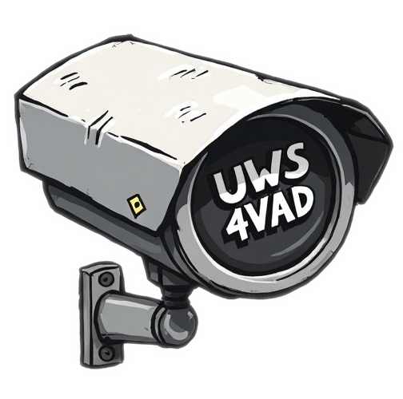

<p align="center"> </p>

## <p align="center"> Unified WorkStation 4 Video Anomaly Detection </p>

---

UWS4VAD is an attempt to unify common pratices in VAD methods, with support for both UCFC and XDV datasets, configured trough [hydra](https://hydra.cc/docs/intro/) for a modular and experimental pipeline. Includes feature extraction for both visual (trough [timm]() models) and audio (trough HEAR-based models).~


> [!important]
> **Looking for contributions/suggestions of any kind.** *If you have interest in the project, please dont hesitate to contact, will be more than grateful for such.*


---
### Installation
```bash
conda env create -f environment.yml && conda activate uws4vad
```


---
### Usage

Basic overview of configuration setup
```bash
python main.py --help
```


---
### Acknowledgments

Gratzie to author's works that are either part of this project, served as inspiration or contributed to VAD. Refer to [methods](file://docs/meth.md) for a complete and updated list. 


--- 

### Citation

Give a shout if used:

```bibtex
@misc{uws4vad,
author = {Zuble Barbas},
title = {A Unified WorkStation for Video Anomaly Detection.},
publisher = {GitHub},
journal = {GitHub repository},
howpublished = {\url{https://github.com/zuble/uws4vad}},
year = {2024},
}
```