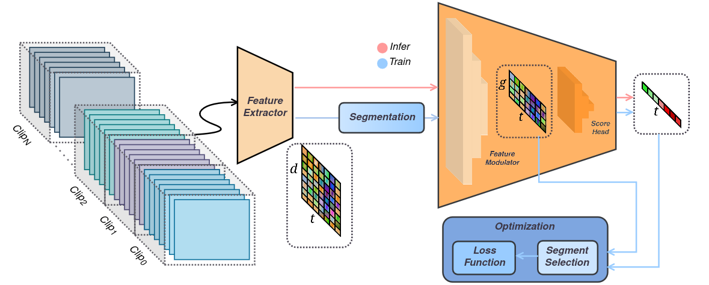

## Pipeline 

<p align="center"> </p>


## Data

Under the set folder at *path.data_root* the following `tree -d` is excepted

```bash
DS ## videos
├── UCF
│   ├── TEST
│   └── TRAIN
└── XDV
    ├── TEST
    └── TRAIN
FEAT ## features
├── UCF
│   └── RGB 
│       ...
│       └── I3DROCNG ## each folder name match the value of data.frgb.id
│           ├── TEST
│           └── TRAIN
└── XDV
    ├── AUD 
    │   ...
    │   └── VGGISH ## each folder name match the value of data.faud.id
    │       ├── TEST
    │       └── TRAIN
    └── RGB 
        ...
        └── CLIPTSA ## each folder name match the value of data.frgb.id
            ├── TEST
            └── TRAIN
```

videos ucf [UCFC](https://www.crcv.ucf.edu/projects/real-world/)
features rgb ucf [I3DROCNG](https://github.com/Roc-Ng/DeepMIL)

videos xdv & features rgb xdv & features aud xdv [XDV](https://roc-ng.github.io/XD-Violence/) 
features rgb xdv [VADCLIP](https://github.com/nwpu-zxr/VadCLIP)
features rgb ucf/xdv [CLIPTSA](https://github.com/joos2010kj/CLIP-TSA)


## Usage Examples

1. Basic training with RTFM:
```bash
python main.py model=rtfm data=xdv
```

2. Debug mode with visualization:
```bash
python main.py model=rtfm data=xdv debug=vis
```

3. Custom experiment setup:
```bash
python main.py model=rtfm data=xdv exp=cmala dataload=high
```