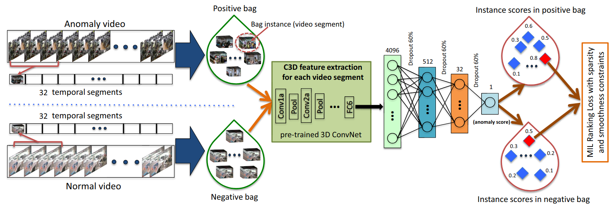

Below are the collected works (mainly) under Weakly supervision (UCFC/XDV), but also new benchamrks.

Results refer to the test subset which methods were evaluated, *o(verall)/a(nomaly)*, when provided.

<table><thead>
  <tr>
    <th>Year</th>
    <th>Method,Code,Paper</th>
    <th>Anom Criterion</th>
    <th>Supervision</th>
    <th>Feature</th>
    <th>UCF  (AUCo,AUCa,FAR)</th>
    <th>XDV  (APo,APa,FAR)</th>
  </tr></thead>
<tbody>
  <tr>
    <td>2018</td>
    <td>MIR   </td>
    <td> 
 

  
  </td>
    <td></td>
    <td>C3D I3D</td>
    <td>0.7541,-,- 0.7792,-,-</td>
    <td>-,-,- -,-,-</td>
  </tr>
  <tr>
    <td>2019</td>
    <td>GCN  </td>
    <td></td>
    <td></td>
    <td>C3D TSN</td>
    <td>0.8192,-,- 0.8212,-,-</td>
    <td>-,-,- -,-,-</td>
  </tr>
  <tr>
    <td>2019</td>
    <td>MA  </td>
    <td></td>
    <td></td>
    <td>PWC-OF</td>
    <td>0.7210,-,-</td>
    <td>-,-,-</td>
  </tr>
  <tr>
    <td>2019</td>
    <td>TCN  </td>
    <td></td>
    <td></td>
    <td>C3D </td>
    <td>0.7866,-,-</td>
    <td>-,-,-</td>
  </tr>
  <tr>
    <td>2020</td>
    <td>SRG  </td>
    <td></td>
    <td></td>
    <td>C3D </td>
    <td>0.7954,-,0.13</td>
    <td>-,-,-</td>
  </tr>
  <tr>
    <td>2020</td>
    <td>ARN  </td>
    <td></td>
    <td></td>
    <td>I3D </td>
    <td>0.7571,-,-</td>
    <td>-,-,-</td>
  </tr>
  <tr>
    <td>2020</td>
    <td>HLN/XDV  </td>
    <td></td>
    <td></td>
    <td>I3D I3D+VGG</td>
    <td>0.8244,-,- -,-,-</td>
    <td>-,-,- 0.7864,-,-</td>
  </tr>
  <tr>
    <td>2020</td>
    <td>WSAL  </td>
    <td></td>
    <td></td>
    <td>I3D  R(2+1)D TSN</td>
    <td>0.7418,-,-   0.7529,-,-   0.8538,0.6738,-</td>
    <td>-,-,-   -,-,-   -,-,-</td>
  </tr>
  <tr>
    <td>2020</td>
    <td>CLAWS </td>
    <td></td>
    <td></td>
    <td>C3D</td>
    <td>0.8303,-,0.12</td>
    <td>-,-,-</td>
  </tr>
  <tr>
    <td>2021</td>
    <td>MIST </td>
    <td></td>
    <td></td>
    <td>C3D  I3D</td>
    <td>0.8140,-,2.19   0.8230,-,0.13</td>
    <td>-,-,-   -,-,-</td>
  </tr>
  <tr>
    <td>2021</td>
    <td>AVF </td>
    <td></td>
    <td></td>
    <td>I3D+VGG</td>
    <td>-,-,-</td>
    <td>0.8169,-,-</td>
  </tr>
  <tr>
    <td>2021</td>
    <td>RTFM   </td>
    <td></td>
    <td></td>
    <td>C3D  I3D</td>
    <td>0.8328,-,-   0.8430,-,-</td>
    <td>0.7589,-,-   0.7781,-,-</td>
  </tr>
  <tr>
    <td>2021</td>
    <td>XEL    </td>
    <td></td>
    <td></td>
    <td>C3D</td>
    <td>0.8260,-,-</td>
    <td>-,-,-</td>
  </tr>
  <tr>
    <td>2021</td>
    <td>CA  </td>
    <td></td>
    <td></td>
    <td>C3D  TSN  I3D </td>
    <td>0.8340,-,-   0.8352,-,-   0.8462,-,-</td>
    <td>-,-,-   -,-,-   0.7690,-,-</td>
  </tr>
  <tr>
    <td>2021</td>
    <td>MS-BS  </td>
    <td></td>
    <td></td>
    <td>I3D</td>
    <td>0.8353,-,-</td>
    <td>-,-,-</td>
  </tr>
  <tr>
    <td>2021</td> 
    <td>DAM  </td>
    <td></td>
    <td></td>
    <td>I3D</td>
    <td>0.8267,-,0.3</td>
    <td>-,-,-</td>
  </tr>
  <tr>
    <td>2022</td>
    <td>CMALA   </td>
    <td></td>
    <td></td>
    <td>I3D+VGG</td>
    <td>-,-,-</td>
    <td>0.8354,-,-</td>
  </tr>
  <tr>
    <td>2022</td>
    <td>CLAWS+ </td>
    <td></td>
    <td></td>
    <td>C3D  3DRN </td>
    <td>0.8337,-,0.11   0.8416,-,0.09</td>
    <td>-,-,-   -,-,-</td>
  </tr>
  <tr>
    <td>2022</td>
    <td>WSTR  </td>
    <td></td>
    <td></td>
    <td>I3D </td>
    <td>0.8317,-,-</td>
    <td>-,-,-</td>
  </tr>
  <tr>
    <td>2022</td>
    <td>STA </td>
    <td></td>
    <td></td>
    <td>C3D I3D</td>
    <td>0.8160,-,-   0.8300,-,-</td>
    <td>-,-,-   -,-,-</td>
  </tr>
  <tr>
    <td>2022</td>
    <td>MSL  </td>
    <td></td>
    <td></td>
    <td>C3D  I3D  VSWIN</td>
    <td>0.8285,-,-   0.8530,-,-   0.8562,-,-</td>
    <td>0.7553,-,-   0.7828,-,-   0.7859,-,-</td>
  </tr>
  <tr>
    <td>2022</td>
    <td>SGMIR </td>
    <td></td>
    <td></td>
    <td>I3D</td>
    <td>0.8170,-,-</td>
    <td>-,-,-</td>
  </tr>
  <tr>
    <td>2022</td>
    <td>TCA </td>
    <td></td>
    <td></td>
    <td>C3D  I3D</td>
    <td>0.8208,-,0.11   0.8375,-,0.05</td>
    <td>-,-,-   -,-,-</td>
  </tr>
  <tr>
    <td>2022</td>
    <td>MACIL   </td>
    <td></td>
    <td></td>
    <td>I3D+VGG </td>
    <td>-,-,-</td>
    <td>0.8340,-,-</td>
  </tr>
  <tr>
    <td>2022</td>
    <td>LAN </td>
    <td></td>
    <td></td>
    <td>I3D </td>
    <td>0.8512,-,-</td>
    <td>0.8072,-,-</td>
  </tr>
  <tr>
    <td>2022</td>
    <td>OpenVAD   </td>
    <td></td>
    <td></td>
    <td></td>
    <td></td>
    <td></td>
  </tr>
  <tr>
    <td>2022</td>
    <td>ANM   </td>
    <td></td>
    <td></td>
    <td>I3D  I3D+VGG</td>
    <td>0.8299,-,-   -,-,-</td>
    <td>-,-,-   0.8491,-,-</td>
  </tr>
  <tr>
    <td>2022</td>
    <td>MSAF  </td>
    <td></td>
    <td></td>
    <td>I3D+OF  I3D+OF+VGG</td>
    <td>0.8134,-,-   -,-,-</td>
    <td>-,-,-   0.8051,-,-</td>
  </tr>
  <tr>
    <td>2022</td>
    <td>TAI </td>
    <td></td>
    <td></td>
    <td>I3D</td>
    <td>0.8573,-,-</td>
    <td>-,-,-</td>
  </tr>
  <tr>
    <td>2022</td>
    <td>BSME </td>
    <td></td>
    <td></td>
    <td>I3D</td>
    <td>0.8363,-,-</td>
    <td>-,-,-</td>
  </tr>
  <tr>
    <td>2022</td>
    <td>MGFN   </td>
    <td></td>
    <td></td>
    <td>I3D  VSwin</td>
    <td>0.8698,-,-   0.8667,-,-</td>
    <td>0.7919,-,-   0.8011,-,-</td>
  </tr>
  <tr>
    <td>2022</td>
    <td>CUN  </td>
    <td></td>
    <td></td>
    <td>I3D  I3D+VGG </td>
    <td>0.8622,-,-   -,-,-</td>
    <td>0.7874,-,-   0.8143,-,-</td>
  </tr>
  <tr>
    <td>2022</td>
    <td>CLIP-TSA   </td>
    <td></td>
    <td></td>
    <td>CLIP</td>
    <td>0.8758,-,-</td>
    <td>0.8219,-,-</td>
  </tr>
  <tr>
    <td>2023</td>
    <td>NGMIL </td>
    <td></td>
    <td></td>
    <td>C3D  I3D </td>
    <td>0.8343,-,-   0.8563,-,-</td>
    <td>0.7591,-,-   0.7851,-,-</td>
  </tr>
  <tr>
    <td>2023</td>
    <td>URDMU <a href="https://github.com/henrryzh1/UR-DMU"><i66mg src="https://img.shields.io/badge/-rgba(0,0,0,0)?logo=pytorch" height="20"></a>  </td>
    <td></td>
    <td></td>
    <td>I3D  I3D+VGG</td>
    <td>0.8697,-,1.05   -,-,-</td>
    <td>0.8166,-,0.65   0.8177,-,-</td>
  </tr>
  <tr>
    <td>2023</td>
    <td>UMIL  </td>
    <td></td>
    <td></td>
    <td>X-CLIP</td>
    <td>0.8675,0.6868,-</td>
    <td>-,-,-</td>
  </tr>
  <tr>
    <td>2023</td>
    <td>LSTC  </td>
    <td></td>
    <td></td>
    <td>C3D I3D </td>
    <td>0.8347,-,-   0.8588,-,-</td>
    <td>-,-,-   -,-,-</td>
  </tr>
  <tr>
    <td>2023</td>
    <td>BERTMIL  </td>
    <td></td>
    <td></td>
    <td>I3D+FLOW  I3D </td>
    <td>0.8671,-,-   -,-,-</td>
    <td>-,-,-   0.8210,-,-</td>
  </tr>
  <tr>
    <td>2023</td>
    <td>SLAMBS </td>
    <td></td>
    <td></td>
    <td>I3D </td>
    <td>0.8619,-,-</td>
    <td>0.8423,-,-</td>
  </tr>
  <tr>
    <td>2023</td>
    <td>TEVAD  </td>
    <td></td>
    <td></td>
    <td></td>
    <td></td>
    <td></td>
  </tr>
  <tr>
    <td>2023</td>
    <td>HYPERVD  </td>
    <td></td>
    <td></td>
    <td>I3D+VGG </td>
    <td>-,-,-</td>
    <td>0.8567,-,-</td>
  </tr>
  <tr>
    <td>2023</td>
    <td>PEL4VAD    </td>
    <td></td>
    <td></td>
    <td>I3D </td>
    <td>0.8676,0.7224,0.43</td>
    <td>0.8559,0.7026,0.57</td>
  </tr>
  <tr>
    <td>2023</td>
    <td>VAR  </td>
    <td></td>
    <td></td>
    <td></td>
    <td></td>
    <td></td>
  </tr>
  <tr>
    <td>2023</td>
    <td>CNN-VIT </td>
    <td></td>
    <td></td>
    <td>C3D  I3D  CLIP  C3D+CLIP&nbsp;&nbsp; I3D+CLIP </td>
    <td>0.8578,-,-   0.8650,-,-   0.8763,-,-   0.8802,-,-   0.8897,-,-</td>
    <td>-,-,-   -,-,-   -,-,-   -,-,-   -,-,-</td>
  </tr>
  <tr>
    <td>2023</td>
    <td>SAA      </td>
    <td></td>
    <td></td>
    <td>I3D  I3D+VGG </td>
    <td>0.8619,0.6877,-   -,-,-</td>
    <td>0.8359,0.8419,-   0.8423,-,-</td>
  </tr>
  <tr>
    <td>2023</td>
    <td>AnomCLIP  </td>
    <td></td>
    <td></td>
    <td>ViT-B/16 </td>
    <td>0.8636,-,-</td>
    <td>0.7851,-,-</td>
  </tr>
  <tr>
    <td>2023</td>
    <td>MTDA </td>
    <td></td>
    <td></td>
    <td>I3D+VGG </td>
    <td>-,-,-</td>
    <td>0.8444,-,-</td>
  </tr>
  <tr>
    <td>2023</td>
    <td>BNWVAD   </td>
    <td></td>
    <td></td>
    <td>I3D  I3D+VGG </td>
    <td>0.8724,0.7171,-   -,-,-</td>
    <td>0.8493,0.8545,-   0.8526,-,-</td>
  </tr>
  <tr>
    <td>2023</td>
    <td>DEN    </td>
    <td></td>
    <td></td>
    <td>I3D  I3D+VGG </td>
    <td>0.8633,-,-   -,-,-</td>
    <td>0.8166,-,-   0.8313,-,-</td>
  </tr>
  <tr>
    <td>2023</td>
    <td>VADCLIP    </td>
    <td></td>
    <td></td>
    <td>I3D+CLIP</td>
    <td>0.8802,-,-</td>
    <td>0.8451,-,-</td>
  </tr>
  <tr>
    <td>2024</td>
    <td>VAD-LLaMA  </td>
    <td></td>
    <td></td>
    <td></td>
    <td></td>
    <td></td>
  </tr>
  <tr>
    <td>2024</td>
    <td>LAP </td>
    <td></td>
    <td></td>
    <td></td>
    <td></td>
    <td></td>
  </tr>
  <tr>
    <td>2024</td>
    <td>GlanceVAD   </td>
    <td></td>
    <td></td>
    <td></td>
    <td></td>
    <td></td>
  </tr>
    <tr>
    <td>2024 </td>
    <td>OVVAD </td>
    <td></td>
    <td> </td>
    <td></td>
    <td></td>
    <td></td>
  </tr>
  <tr>
    <td>2024</td>
    <td>LAVAD  </td>
    <td></td>
    <td></td>
    <td> BLIP-2 ensemble   Llama-2-13b-chat   ImageBind multimodal encoders </td>
    <td></td>
    <td></td>
  </tr>
  <tr>
    <td>2024</td>
    <td>TPWNG </td>
    <td></td>
    <td></td>
    <td></td>
    <td></td>
    <td></td>
  </tr>
  <tr>
    <td>2024</td>
    <td>MSBT  </td>
    <td></td>
    <td></td>
    <td>I3D+VGG  I3D+VGG+TV-L1 </td>
    <td>-,-,-   -,-,-</td>
    <td>0.8254,-,-   0.8432,-,-</td>
  </tr>
  <tr>
    <td>2024</td>
    <td>HAWK  </td>
    <td></td>
    <td></td>
    <td></td>
    <td></td>
    <td></td>
  </tr>
  <tr>
    <td>2024</td>
    <td>PEMIL  </td>
    <td></td>
    <td></td>
    <td></td>
    <td></td>
    <td></td>
  </tr>
  <tr>
    <td>2024</td>
    <td>VAD-LLaMA  </td>
    <td></td>
    <td></td>
    <td></td>
    <td></td>
    <td></td>
  </tr> 
  
  <tr>
    <td>2024</td>
    <td>UCFA-VALU  </td>
    <td>   </td>
    <td></td>
    <td></td>
    <td></td>
    <td></td>
  </tr> 
  <tr>
    <td>2024</td>
    <td>Holmes-VAD  </td>
    <td></td>
    <td></td>
    <td></td>
    <td></td>
    <td></td>
  </tr>
  <tr>  
    <td>2024</td>
    <td>Holmes-VAU   </td>
    <td>  </td>
    <td></td>
    <td>InternVL2-2B (RGB+TEXT)</td>
    <td></td>
    <td></td>
  </tr>
  <tr>
    <td>2024</td>
    <td>FE-VAD </td>
    <td></td>
    <td></td>
    <td></td>
    <td></td>
    <td></td>
  </tr>
  <tr>
    <td rowspan="2">2025</td>
    <td rowspan="2">PLOVAD   </td>
    <td rowspan="2">  </td>
    <td></td>
    <td rowspan="2">CLIP</td>
    <td></td>
    <td></td>
  </tr>
    <td></td>
    <td></td>
    <td></td>
  </tr>
  <tr>
    <td>2025</td>
    <td>MTFL </a>  </td>
    <td>ac</td>
    <td></td>
    <td>feat</td>
    <td>ucfc</td>
    <td>xdv</td>
  </tr>
  <tr>
    <td>2025</td>
    <td>Sherlock   </td>
    <td></td>
    <td></td>
    <td>feat</td>
    <td>ucfc</td>
    <td>xdv</td>
  </tr>
  <tr>
    <td>2025</td>
    <td>UCFC-DVS   </td>
    <td>ac</td>
    <td></td>
    <td>feat</td>
    <td>ucfc</td>
    <td>xdv</td>
  </tr>
  <!-- <tr>
    <td>2025</td>
    <td>VADMamba   </td>
    <td>ac</td>
    <td></td>
    <td>feat</td>
    <td>ucfc</td>
    <td>xdv</td>
  </tr> -->
  <tr>
    <td>2025</td>
    <td>VERA   </td>
    <td></td>
    <td></td>
    <td>feat</td>
    <td>ucfc</td>
    <td>xdv</td>
  </tr>
  <tr>
    <td>2025</td>
    <td>AVadCLIP </td>
    <td>ac</td>
    <td></td>
    <td>feat</td>
    <td>ucfc</td>
    <td>xdv</td>
  </tr>
  <tr>
    <td>2025</td>
    <td>EventVAD  </td>
    <td></td>
    <td></td>
    <td>feat</td>
    <td>ucfc</td>
    <td>xdv</td>
  </tr>
  <tr>
    <td>2025</td>
    <td>ProDisc-VAD   </td>
    <td>ac</td>
    <td></td>
    <td>CLIP ViT-B/16</td>
    <td>ucfc</td>
    <td>xdv</td>
  </tr>
  <tr>
    <td></td>
    <td></td>
    <td></td>
    <td></td>
    <td></td>
    <td></td>
  </tr>
</tbody></table>

 
  
 legend 
 

<!-- 

 
[?logo=pytorch)](#)
[?logo=arxiv&logoColor=red)](#)  
-->

-     <!-- Orange -->

-  <!-- Deep Sky Blue -->

-  <!-- Gray -->

- 

- 

- 
  - Badge is a link to file implementing the method (or better be config since it contains everything).

 

<!--  -->

<!--

 legend 

   
 
 
 

?logo=github&logoColor=green)
-->

## Datasets
[//]: https://www.tablesgenerator.com/html_tables

<table><thead>
  <tr>
    <th rowspan="3">Year</th>
    <th rowspan="3">Dataset  </th>
    <th colspan="2" rowspan="2">Video</th>
    <th rowspan="3"># Anomaly Types</th>
    <th colspan="4">GT</th>
  </tr>
  <tr>
    <th>Location</th>
    <th colspan="3">Text</th>
  </tr>
  <tr>
    <th>#</th>
    <th>Audio</th>
    <th>Level</th>
    <th>clip-event</th>
    <th>event-level</th>
    <th>video-level</th>
  </tr></thead>
<tbody>
  <tr>
    <td>2018</td>
    <td>UCF-Crime <a href="https://www.crcv.ucf.edu/projects/real-world/">:link:</a> <a href="https://github.com/WaqasSultani/AnomalyDetectionCVPR2018">OG:file_folder:</a> <a href="https://github.com/Roc-Ng/DeepMIL">Torch:file_folder:</a> <a href="https://openaccess.thecvf.com/content_cvpr_2018/papers/Sultani_Real-World_Anomaly_Detection_CVPR_2018_paper.pdf">:newspaper:</a></td>
    <td></td>
    <td></td>
    <td>13</td>
    <td></td>
    <td></td>
    <td></td>
    <td></td>
  </tr>
  <tr>
    <td>2020</td>
    <td>XD-Violence <a href="https://roc-ng.github.io/XD-Violence/">:link:</a> <a href="https://github.com/Roc-Ng/XDVioDet">:file_folder:</a> <a href="https://arxiv.org/pdf/2007.04687">:newspaper:</a></td>
    <td></td>
    <td></td>
    <td>6</td>
    <td></td>
    <td></td>
    <td></td>
    <td></td>
  </tr>
  <tr>
    <td></td>
    <td>UCF_Crime Extra ++ <a href="https://github.com/hibrahimozturk/temporal_anomaly_detection">:file_folder:</a> <a href="https://arxiv.org/pdf/2104.06653">:newspaper:</a></td>
    <td></td>
    <td></td>
    <td></td>
    <td></td>
    <td></td>
    <td></td>
    <td></td>
  </tr>
  <tr>
    <td></td>
    <td>MSAD <a href="https://msad-dataset.github.io/">:link:</a> <a href="https://github.com/Tom-roujiang/MSAD">:file_folder:</a> <a href="https://arxiv.org/abs/2402.04857">:newspaper:</a></td>
    <td></td>
    <td></td>
    <td></td>
    <td></td>
    <td></td>
    <td></td>
    <td></td>
  </tr>
  <tr>
    <td></td>
    <td>CUVA/ECVA <a href="https://github.com/fesvhtr/CUVA">:file_folder:</a> <a href="https://github.com/Dulpy/ECVA">:file_folder:</a>  <a href="https://arxiv.org/pdf/2412.07183">:newspaper:</a></td>
    <td></td>
    <td></td>
    <td></td>
    <td></td>
    <td></td>
    <td></td>
    <td></td>
  </tr>
  <tr>
    <td></td>
    <td>HIVAU-70k <a href="https://www.tablesgenerator.com/html_tables">:link:</a> <a href="https://www.tablesgenerator.com/html_tables">:file_folder:</a> <a href="https://www.tablesgenerator.com/html_tables">:newspaper:</a></td>
    <td></td>
    <td></td>
    <td></td>
    <td></td>
    <td></td>
    <td></td>
    <td></td>
  </tr>
  :
  <tr>
    <td></td>
    <td>TAU-106K <a href="https://www.tablesgenerator.com/html_tables">:link:</a> <a href="https://github.com/cool-xuan/TABot">:file_folder:</a> <a href="https://www.tablesgenerator.com/html_tables">:newspaper:</a></td>
    <td></td>
    <td></td>
    <td></td>
    <td></td>
    <td></td>
    <td></td>
    <td></td>
  </tr>
  <tr>
    <td></td>
    <td>___<a href="https://www.tablesgenerator.com/html_tables">:link:</a> <a href="https://www.tablesgenerator.com/html_tables">:file_folder:</a> <a href="https://www.tablesgenerator.com/html_tables">:newspaper:</a></td>
    <td></td>
    <td></td>
    <td></td>
    <td></td>
    <td></td>
    <td></td>
    <td></td>
  </tr>
</tbody></table>

For a more detailed information/stats about datasets refer to [Awesome-Video-Anomaly-Detection](https://github.com/Junxi-Chen/Awesome-Video-Anomaly-Detection/tree/main) by [@Junxi-Chen](https://github.com/Junxi-Chen)

<!---
UCA [62] only provides clip-level captions, overlooking the understanding of anomalies across longer time spans. 
CUVA [9] and Hawk [45], on the other hand, only offer video-level instruction data, neglecting finer-grained visual perception and anomaly analysis. 
Our proposed HIVAU-70k takes a multi-temporal granularity perspective. It enables progressive and comprehensive learning, from short-term visual perception to long-term anomaly reasoning.

Methods,#Catogories,#Samples,Text(clip-level,event-level,video-level),TempAnno,MLLM-tuning  
UCA,13,23542,✓,✗,✗,✓,✗
LAVAD,N/A,N/A,✓,✗,✓,✗,✗
VAD-VideoLLama,13/7,2400,✗,✗,✓,✗,projection
CUVA,11,6000,✗,✗,✓,✗,✗ 
Hawk,-,16000,✗,✗,✓,✗,projection 
HIVAU-70k, 19,70000,✓,✓,✓,✓,LoRA

-->

## ECVA benchmark
<table>
    <thead>
        <tr>
            <th rowspan="2">Year</th>
            <th rowspan="2">Method </th>
            <th colspan="3">AnomEval</th>
        </tr>
        <tr>
            <th>Cause</th>
            <th>Description</th>
            <th>Effect</th>
    </tr>
    </thead>
    <tbody>
        <tr>
            <td>2023</td>
            <td>VILA [?logo=pytorch)]() [?logo=arxiv&logoColor=red)]() </td>
            <td>0.35</td>
            <td>0.3749</td>
            <td>0.3188</td>
        </tr>
        <tr>
            <td>2024</td>
            <td>AnomShield</td>
            <td>0.33</td>
            <td>0.4057</td>
            <td>0.3509</td>
        </tr>
    </tbody>
</table>

## HIVAU-70K benchmark
<table>
    <thead>
        <tr>
            <th rowspan="2">Year</th>
            <th rowspan="2">Method </th>
            <th colspan="3">AnomEval</th>
        </tr>
        <tr>
            <th>Cause</th>
            <th>Description</th>
            <th>Effect</th>
    </tr>
    </thead>
    <tbody>
        <tr>
            <td>2023</td>
            <td>VILA [?logo=pytorch)]() [?logo=arxiv&logoColor=red)]() </td>
            <td>0.35</td>
            <td>0.3749</td>
            <td>0.3188</td>
        </tr>
        <tr>
            <td>2024</td>
            <td>AnomShield</td>
            <td>0.33</td>
            <td>0.4057</td>
            <td>0.3509</td>
        </tr>
    </tbody>
</table>

### Other Collections/Resources

- Generalized Video Anomaly Event Detection: Systematic Taxonomy and Comparison of Deep Models  -> 

- Networking Systems for Video Anomaly Detection: A Tutorial and Survey  -> A great starting point for VAD, covering supervision development and progression (U,Ws,Fu)

- [Quo Vadis, Anomaly Detection?  LLMs and VLMs in the Spotlight](http://arxiv.org/abs/2412.18298)  -> A survey the integration of large language models (LLMs) and vision-language models (VLMs) in video anomaly detection (VAD)

- [Markdown-Cheatsheet](https://github.com/lifeparticle/Markdown-Cheatsheet)

<!---

https://www.tablesgenerator.com/html_tables

ICONS
  https://simpleicons.org/
  https://shields.io/docs/logos   https://badges.pages.dev/
  

  https://img.shields.io/badge/any_text-you_like-blue
  https://img.shields.io/badge/just%20the%20message-8A2BE2
-->

<!-- 
| Year | Method |  Feature & Supervision | UCF (AUCo,AUCa,FAR) | XDV (APo,APa,FAR) |
|------|--------|------------------------|---------------------|-------------------|
| 2018 | MIR  [?logo=pytorch)](https://github.com/Roc-Ng/DeepMIL) [?logo=arxiv&logoColor=red)](#)  | C3D    I3D  | 0.7541,-,-   0.7792,-,- | -,-,-   -,-,- | 
| 2019 | GCN [?logo=pytorch)](https://github.com/jx-zhong-for-academic-purpose/GCN-Anomaly-Detection) [?logo=arxiv&logoColor=red)](#) | C3D    TSN  | 0.8192,-,-   0.8212,-,- | -,-,-   -,-,- |
| 2019 | MA  [?logo=arxiv&logoColor=red)](#) | PWC-OF  | 0.7210,-,- | -,-,- |
| 2019 | TCN  [?logo=arxiv&logoColor=red)](#) | C3D  | 0.7866,-,- | -,-,- |
| 2020 | SRG  [?logo=arxiv&logoColor=red)](#) | C3D  | 0.7954,-,0.13 | -,-,- |
| 2020 | ARN [?logo=pytorch)](https://github.com/wanboyang/Anomaly_AR_Net_ICME_2020) [?logo=arxiv&logoColor=red)](#) | I3D  | 0.7571,-,- | -,-,- |
| 2020 | HLN/XDV [?logo=pytorch)](https://github.com/Roc-Ng/XDVioDet) [?logo=arxiv&logoColor=red)](#) | I3D    I3D+VGG  | 0.8244,-,-   -,-,- | -,-,-   0.7864,-,- |
| 2020 | WSAL [?logo=pytorch)](https://github.com/ktr-hubrt/WSAL) [?logo=arxiv&logoColor=red)](#) | I3D    R(2+1)D    TSN  | 0.7418,-,-   0.7529,-,-   0.8538,0.6738,- | -,-,-   -,-,-   -,-,- |
| 2020 | CLAWS  [?logo=arxiv&logoColor=red)](#) | C3D  | 0.8303,-,0.12 | -,-,- |
| 2021 | MIST  [?logo=arxiv&logoColor=red)](#) | C3D    I3D  | 0.8140,-,2.19   0.8230,-,0.13 | -,-,-   -,-,- |
| 2021 | AVF  [?logo=arxiv&logoColor=red)](#) | I3D+VGG  | -,-,- | 0.8169,-,- |
| 2021 | RTFM [?logo=pytorch)](https://github.com/tianyu0207/RTFM) [?logo=arxiv&logoColor=red)](#)  | C3D    I3D  | 0.8328,-,-   0.8430,-,- | 0.7589,-,-   0.7781,-,- |
| 2021 | XEL [?logo=pytorch)](https://github.com/sdjsngs/XEL-WSAD) [?logo=arxiv&logoColor=red)](#) | C3D  | 0.8260,-,- | -,-,- |
| 2021 | CA [?logo=pytorch)](https://github.com/changsn/Contrastive-Attention-for-Video-Anomaly-Detection) [?logo=arxiv&logoColor=red)](#) | C3D    TSN   I3D  | 0.8340,-,-   0.8352,-,-   0.8462,-,- | -,-,-   -,-,-   0.7690,-,- |
| 2021 | MS-BS [?logo=pytorch)](#) [?logo=arxiv&logoColor=red)](#) | I3D  | 0.8353,-,- | -,-,- |
| 2021 | DAM [?logo=tensorflow)](https://github.com/snehashismajhi/DAM-Anomaly-Detection) [?logo=arxiv&logoColor=red)](#) | I3D  | 0.8267,-,0.3 | -,-,- |
| 2022 | CMALA [?logo=pytorch)](https://github.com/yujiangpu20/cma_xdVioDet) [?logo=arxiv&logoColor=red)](#)  | I3D+VGG  | -,-,- | 0.8354,-,- |
| 2022 | CLAWS+  [?logo=arxiv&logoColor=red)](#) | C3D    3DRN  | 0.8337,-,0.11   0.8416,-,0.09 | -,-,-   -,-,- |
| 2022 | WSTR [?logo=pytorch)](https://github.com/justsmart/WSTD-VAD) [?logo=arxiv&logoColor=red)](#) | I3D  | 0.8317,-,- | -,-,- |
| 2022 | STA  [?logo=arxiv&logoColor=red)](#) | C3D    I3D  | 0.8160,-,-   0.8300,-,- | -,-,-   -,-,- |
| 2022 | MSL [?logo=pytorch)](https://github.com/xidianai/MSL) [?logo=arxiv&logoColor=red)](#) | C3D    I3D    VSWIN | 0.8285,-,-   0.8530,-,-   0.8562,-,- | 0.7553,-,-   0.7828,-,-   0.7859,-,- |
| 2022 | SGMIR  [?logo=arxiv&logoColor=red)](#) | I3D  | 0.8170,-,- | -,-,- |
| 2022 | TCA  [?logo=arxiv&logoColor=red)](#) | C3D    I3D  | 0.8208,-,0.11   0.8375,-,0.05 | -,-,-   -,-,- |
| 2022 | MACIL [?logo=pytorch)](https://github.com/JustinYuu/MACIL_SD) [?logo=arxiv&logoColor=red)](#)  | I3D+VGG  | -,-,- | 0.8340,-,- |
| 2022 | LAN  [?logo=arxiv&logoColor=red)](#) | I3D  | 0.8512,-,- | 0.8072,-,- |
| 2022 | ANM [?logo=pytorch)](https://github.com/sakurada-cnq/salient_feature_anomaly) [?logo=arxiv&logoColor=red)](#)  | I3D    I3D+VGG  | 0.8299,-,-   -,-,- | -,-,-   0.8491,-,- |
| 2022 | MSAF [?logo=pytorch)](https://github.com/Video-AD/MSFA) [?logo=arxiv&logoColor=red)](#) | I3D+OF    I3D+OF+VGG  | 0.8134,-,-   -,-,- | -,-,-   0.8051,-,- |
| 2022 | TAI  [?logo=arxiv&logoColor=red)](#) | I3D  | 0.8573,-,- | -,-,- |
| 2022 | BSME  [?logo=arxiv&logoColor=red)](#) | I3D  | 0.8363,-,- | -,-,- |
| 2022 | MGFN [?logo=pytorch)](https://github.com/carolchenyx/MGFN) [?logo=arxiv&logoColor=red)](#)  | I3D    VSwin  | 0.8698,-,-   0.8667,-,- | 0.7919,-,-   0.8011,-,- |
| 2022 | CUN [?logo=pytorch)](https://github.com/ArielZc/CU-Net) [?logo=arxiv&logoColor=red)](#) | I3D    I3D+VGG  | 0.8622,-,-   -,-,- | 0.7874,-,-   0.8143,-,- |
| 2022 | CLIP-TSA [?logo=pytorch)](https://github.com/joos2010kj/CLIP-TSA) [?logo=arxiv&logoColor=red)](#)  | CLIP  | 0.8758,-,- | 0.8219,-,- |
| 2023 | NGMIL  [?logo=arxiv&logoColor=red)](#) | C3D    I3D  | 0.8343,-,-   0.8563,-,- | 0.7591,-,-   0.7851,-,- |
| 2023 | URDMU [?logo=pytorch)](https://github.com/henrryzh1/UR-DMU) [?logo=arxiv&logoColor=red)](#) | I3D    I3D+VGG  | 0.8697,-,1.05   -,-,- | 0.8166,-,0.65   0.8177,-,- |
| 2023 | UMIL [?logo=pytorch)](https://github.com/ktr-hubrt/UMIL) [?logo=arxiv&logoColor=red)](https://arxiv.org/pdf/2303.12369v1) | X-CLIP  | 0.8675,0.6868,- | -,-,- |
| 2023 | LSTC [?logo=pytorch)](https://github.com/shengyangsun/LSTC_VAD) [?logo=arxiv&logoColor=red)](#) | C3D    I3D  | 0.8347,-,-   0.8588,-,- | -,-,-   -,-,- |
| 2023 | BERTMIL [?logo=pytorch)](https://github.com/wjtan99/BERT_Anomaly_Video_Classification) [?logo=arxiv&logoColor=red)](#) | I3D+FLOW    I3D  | 0.8671,-,-   -,-,- | -,-,-   0.8210,-,- |
| 2023 | SLAMBS  [?logo=arxiv&logoColor=red)](#) | I3D  | 0.8619,-,- | 0.8423,-,- |
| 2023 | TEVAD [?logo=pytorch)](https://github.com/coranholmes/TEVAD) [?logo=arxiv&logoColor=red)](#) | | | |
| 2023 | HYPERVD [?logo=pytorch)](https://github.com/xiaogangpeng/HyperVD) [?logo=arxiv&logoColor=red)](#) | I3D+VGG  | -,-,- | 0.8567,-,- |
| 2023 | PEL4VAD [?logo=pytorch)](https://github.com/yujiangpu20/PEL4VAD) [?logo=arxiv&logoColor=red)](#) | I3D  | 0.8676,0.7224,0.43 | 0.8559,0.7026,0.57 |
| 2023 | VAR [?logo=pytorch)](https://github.com/Roc-Ng/VAR) [?logo=arxiv&logoColor=red)](#) | | | |
| 2023 | CNN-VIT  [?logo=arxiv&logoColor=red)](#) | C3D    I3D    CLIP    C3D+CLIP    I3D+CLIP  | 0.8578,-,-   0.8650,-,-   0.8763,-,-   0.8802,-,-   0.8897,-,- | -,-,-   -,-,-   -,-,-   -,-,-   -,-,- |
| 2023 | UCFA  [?logo=arxiv&logoColor=red)](#) | | | |
| 2023 | SAA [?logo=pytorch)](https://github.com/2023-MindSpore-4/Code4/tree/main/WS-VAD-mindspore-main) [?logo=arxiv&logoColor=red)](#) | I3D    I3D+VGG  | 0.8619,0.6877,-   -,-,- | 0.8359,0.8419,-   0.8423,-,- |
| 2023 | ANOMCLIP [?logo=pytorch)](https://github.com/lucazanella/AnomalyCLIP) [?logo=arxiv&logoColor=red)](#) | ViT-B/16  | 0.8636,-,- | 0.7851,-,- |
| 2023 | MTDA  [?logo=arxiv&logoColor=red)](#) | I3D+VGG  | -,-,- | 0.8444,-,- |
| 2023 | BNWVAD [?logo=pytorch)](https://github.com/cool-xuan/BN-WVAD) [?logo=arxiv&logoColor=red)](#)  | I3D    I3D+VGG  | 0.8724,0.7171,-   -,-,- | 0.8493,0.8545,-   0.8526,-,- |
| 2023 | DEN [?logo=pytorch)](https://github.com/ArielZc/DE-Net) [?logo=arxiv&logoColor=red)](#) | I3D    I3D+VGG  | 0.8633,-,-   -,-,- | 0.8166,-,-   0.8313,-,- |
| 2023 | VADCLIP [?logo=pytorch)](https://github.com/nwpu-zxr/VadCLIP) [?logo=arxiv&logoColor=red)](#) | I3D+CLIP  | 0.8802,-,- | 0.8451,-,- |
| 2024 | VAD-LLaAMa [?logo=pytorch)](https://github.com/ktr-hubrt/VAD-LLaMA) [?logo=arxiv&logoColor=red)](http://arxiv.org/abs/2401.05702) | | | |
| 2024 | GlanceVAD [?logo=pytorch)](https://github.com/pipixin321/GlanceVAD) [?logo=arxiv&logoColor=red)](http://arxiv.org/abs/2403.06154)  | | | |
| 2024 | LAVAD [?logo=pytorch)](https://github.com/lucazanella/lavad) [?logo=arxiv&logoColor=red)](http://arxiv.org/abs/2404.01014) | | | |
| 2024 | MSBT [?logo=pytorch)](https://github.com/shengyangsun/MSBT) [?logo=arxiv&logoColor=red)](http://arxiv.org/abs/2405.05130) | I3D+VGG    I3D+VGG+TV-L1 | -,-,-   -,-,- | 0.8254,-,-   0.8432,-,- |
| 2024 | HAWK [?logo=pytorch)](https://github.com/jqtangust/hawk) [?logo=arxiv&logoColor=red)](http://arxiv.org/abs/2405.16886) | | | |
| 2024 | PEMIL [?logo=pytorch)](https://github.com/Junxi-Chen/PE-MIL) [?logo=arxiv&logoColor=red)](https://ieeexplore.ieee.org/document/10657732/) | | | |
| 2024 | Holmes-VAD [?logo=pytorch)](https://github.com/pipixin321/HolmesVAD)[?logo=arxiv&logoColor=red)](http://arxiv.org/abs/2406.12235) | | | |
| 2024 | Holmes-VAU [?logo=pytorch)](https://github.com/pipixin321/HolmesVAU)[?logo=arxiv&logoColor=red)](https://arxiv.org/abs/2412.06171) | | | |
||||||
-->