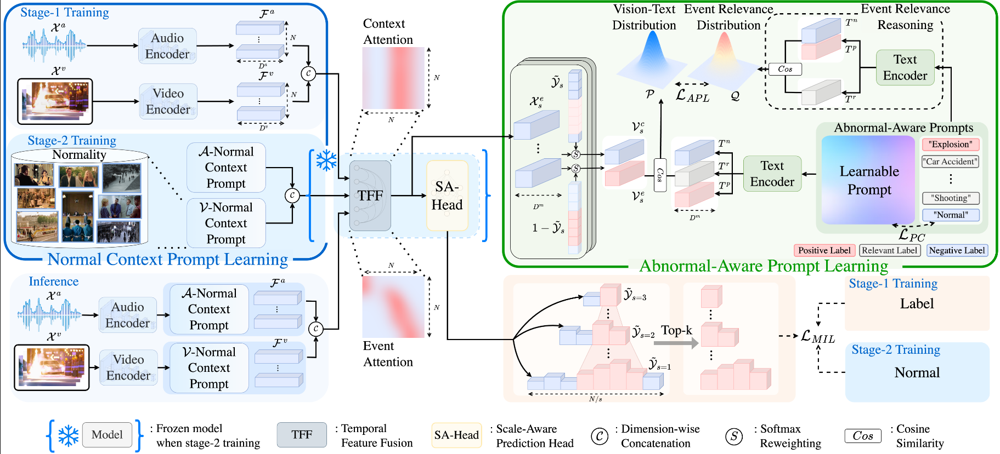

## Datasets

[//]: https://www.tablesgenerator.com/html_tables

<table><thead>
  <tr>
    <th rowspan="3">Year</th>
    <th rowspan="3">Dataset  </th>
    <th colspan="2" rowspan="2">Video</th>
    <th rowspan="3"># Anomaly Types</th>
    <th colspan="4">GT</th>
  </tr>
  <tr>
    <th>Location</th>
    <th colspan="3">Text</th>
  </tr>
  <tr>
    <th>#</th>
    <th>Audio</th>
    <th>Level</th>
    <th>clip-event</th>
    <th>event-level</th>
    <th>video-level</th>
  </tr></thead>
<tbody>
  <tr>
    <td>2018</td>
    <td>UCF-Crime <a href="https://www.crcv.ucf.edu/projects/real-world/">:link:</a> <a href="https://github.com/WaqasSultani/AnomalyDetectionCVPR2018">OG:file_folder:</a> <a href="https://github.com/Roc-Ng/DeepMIL">Torch:file_folder:</a> <a href="https://openaccess.thecvf.com/content_cvpr_2018/papers/Sultani_Real-World_Anomaly_Detection_CVPR_2018_paper.pdf">:newspaper:</a></td>
    <td></td>
    <td></td>
    <td>13</td>
    <td></td>
    <td></td>
    <td></td>
    <td></td>
  </tr>
  <tr>
    <td>2020</td>
    <td>XD-Violence <a href="https://roc-ng.github.io/XD-Violence/">:link:</a> <a href="https://github.com/Roc-Ng/XDVioDet">:file_folder:</a> <a href="https://arxiv.org/pdf/2007.04687">:newspaper:</a></td>
    <td></td>
    <td></td>
    <td>6</td>
    <td></td>
    <td></td>
    <td></td>
    <td></td>
  </tr>
  <tr>
    <td></td>
    <td>Glance VAD <a href="">:file_folder:</a> <a href="">:newspaper:</a></td>
    <td></td>
    <td></td>
    <td></td>
    <td></td>
    <td></td>
    <td></td>
    <td></td>
  </tr>
  <tr>
    <td></td>
    <td>HAWK <a href="">:file_folder:</a> <a href="">:newspaper:</a></td>
    <td></td>
    <td></td>
    <td></td>
    <td></td>
    <td></td>
    <td></td>
    <td></td>
  </tr>
  <tr>
    <td></td>
    <td>UCFA <a href="">:file_folder:</a> <a href="">:newspaper:</a></td>
    <td></td>
    <td></td>
    <td></td>
    <td></td>
    <td></td>
    <td></td>
    <td></td>
  </tr>  
  <tr>
    <td></td>
    <td>HIVAU-70k <a href="https://www.tablesgenerator.com/html_tables">:link:</a> <a href="https://www.tablesgenerator.com/html_tables">:file_folder:</a> <a href="https://www.tablesgenerator.com/html_tables">:newspaper:</a></td>
    <td></td>
    <td></td>
    <td></td>
    <td></td>
    <td></td>
    <td></td>
    <td></td>
  </tr>
  <tr>
    <td></td>
    <td>MSAD <a href="https://msad-dataset.github.io/">:link:</a> <a href="https://github.com/Tom-roujiang/MSAD">:file_folder:</a> <a href="https://arxiv.org/abs/2402.04857">:newspaper:</a></td>
    <td></td>
    <td></td>
    <td></td>
    <td></td>
    <td></td>
    <td></td>
    <td></td>
  </tr>
  <tr>
    <td></td>
    <td>ECVA <a href="https://github.com/fesvhtr/CUVA">:file_folder:</a> <a href="https://github.com/Dulpy/ECVA">:file_folder:</a>  <a href="https://arxiv.org/pdf/2412.07183">:newspaper:</a></td>
    <td></td>
    <td></td>
    <td></td>
    <td></td>
    <td></td>
    <td></td>
    <td></td>
  </tr>
  <tr>
    <td></td>
    <td>Sherlock <a href="">:file_folder:</a> <a href="">:newspaper:</a></td>
    <td></td>
    <td></td>
    <td></td>
    <td></td>
    <td></td>
    <td></td>
    <td></td>
  </tr>
  <tr>
    <td></td>
    <td>UCFC-DVS <a href="">:file_folder:</a> <a href="">:newspaper:</a></td>
    <td></td>
    <td></td>
    <td></td>
    <td></td>
    <td></td>
    <td></td>
    <td></td>
  </tr>
  <tr>
    <td></td>
    <td>VANE <a href="">:file_folder:</a> <a href="">:newspaper:</a></td>
    <td></td>
    <td></td>
    <td></td>
    <td></td>
    <td></td>
    <td></td>
    <td></td>
  </tr>
  <tr>
    <td></td>
    <td>SurveillanceVQA-589K <a href="">:file_folder:</a> <a href="">:newspaper:</a></td>
    <td></td>
    <td></td>
    <td></td>
    <td></td>
    <td></td>
    <td></td>
    <td></td>
  </tr>
  <tr>
    <td></td>
    <td>TAU-106K <a href="https://www.tablesgenerator.com/html_tables">:link:</a> <a href="https://github.com/cool-xuan/TABot">:file_folder:</a> <a href="https://www.tablesgenerator.com/html_tables">:newspaper:</a></td>
    <td></td>
    <td></td>
    <td></td>
    <td></td>
    <td></td>
    <td></td>
    <td></td>
  </tr>
  <tr>
    <td></td>
    <td>___<a href="https://www.tablesgenerator.com/html_tables">:link:</a> <a href="https://www.tablesgenerator.com/html_tables">:file_folder:</a> <a href="https://www.tablesgenerator.com/html_tables">:newspaper:</a></td>
    <td></td>
    <td></td>
    <td></td>
    <td></td>
    <td></td>
    <td></td>
    <td></td>
  </tr>
</tbody></table>

> [!important]
> **WIP** For a more detailed information/stats about datasets refer to [Awesome-Video-Anomaly-Detection](https://github.com/Junxi-Chen/Awesome-Video-Anomaly-Detection/tree/main) by [@Junxi-Chen](https://github.com/Junxi-Chen)

<!---
UCA [62] only provides clip-level captions, overlooking the understanding of anomalies across longer time spans. 
CUVA [9] and Hawk [45], on the other hand, only offer video-level instruction data, neglecting finer-grained visual perception and anomaly analysis. 
Our proposed HIVAU-70k takes a multi-temporal granularity perspective. It enables progressive and comprehensive learning, from short-term visual perception to long-term anomaly reasoning.

Methods,#Catogories,#Samples,Text(clip-level,event-level,video-level),TempAnno,MLLM-tuning  
UCA,13,23542,✓,✗,✗,✓,✗
LAVAD,N/A,N/A,✓,✗,✓,✗,✗
VAD-VideoLLama,13/7,2400,✗,✗,✓,✗,projection
CUVA,11,6000,✗,✗,✓,✗,✗ 
Hawk/-/16000,✗,✗,✓,✗,projection 
HIVAU-70k, 19,70000,✓,✓,✓,✓,LoRA

-->

## Methodos 
Below are the collected works (mainly) under Weakly supervision (UCFC/XDV), but also new benchamrks.

 
  
 legend 
 

<!-- 

 
[?logo=pytorch)](#)
[?logo=arxiv&logoColor=red)](#)  
-->

-  Dataset/Benchmark release paper   

-   Only Video-Level (VL) labelling, either binary or class <!-- Orange -->

-  = Zero-Shot <!-- Gray -->

-  Evaluation on novel anomalies
 <!-- Deep Sky Blue -->

<!-- -  -->

-  Provide a mapping of detected visual anomalies to textual descriptions or semantic cues, using either ditionary, LLM's insights or VLM's textual explanations.

- 
  - Badge is a link to file implementing the method (or better be config since it contains everything).

 

<!--  -->

<!--

 legend 

   
 
 
 

?logo=github&logoColor=green)
-->

### UCFC/XDV

Results refer to the test subset which methods were evaluated, *o(verall)/a(nomaly)*, when provided.

<table><thead>
  <tr>
    <th>Year</th>
    <th>Method</th>
    <th>Code</th>
    <th>Pipeline & Anom Criterion</th>
    <th>Supervision</th>
    <th>Feature</th>
    <th>UCF  (AUCo/AUCa/FAR)</th>
    <th>XDV  (APo/APa/FAR)</th>
  </tr></thead>
<tbody>
  <tr>
    <td>2018</td>
    <td>MIR    
         
    </td>
    <td> 
      
      
    </td>
    <td> 
 

  
  </td>
    <td></td>
    <td>C3D I3D</td>
    <td>75.41 77.92</td>
    <td> </td>
  </tr>
  <tr>
    <td>2019</td>
    <td>GCN </td>
    <td>  </td>
    <td> 
 

  
  </td>
    <td></td>
    <td>C3D TSN</td>
    <td>81.92 82.12</td>
    <td> </td>
  </tr>
  <tr>
    <td>2019</td>
    <td>MA </td>
    <td></td>
    <td></td>
    <td></td>
    <td>PWC-OF</td>
    <td>72.10</td>
    <td></td>
  </tr>
  <tr>
    <td>2019</td>
    <td>TCN </td>
    <td></td>
    <td> 
 

  
  </td>
    <td></td>
    <td>C3D </td>
    <td>78.66</td>
    <td></td>
  </tr>
  <tr>
    <td>2020</td>
    <td>SRF </td>
    <td></td>
    <td> 
 

  
  </td>
    <td></td>
    <td>C3D </td>
    <td>79.54/-/0.13</td>
    <td></td>
  </tr>
  <tr>
    <td>2020</td>
    <td>ARN </td> 
    <td></td>
    <td> </td>
    <td></td>
    <td>I3D </td>
    <td>75.71</td>
    <td></td>
  </tr>
  <tr>
    <td>2020</td>
    <td>HLN 
        
      
    </td>
    <td></td>
    <td> 
 

  
  </td>
    <td></td>
    <td>I3D I3D+VGG</td>
    <td>82.44 </td>
    <td> 78.64</td>
  </tr>
  <tr>
    <td>2020</td>
    <td>WSAL </td>
    <td>  </td>
    <td> 
 

  
  </td>
    <td></td>
    <td>I3D  R(2+1)D TSN</td>
    <td>74.18   75.29   85.38/67.38/-</td>
    <td>      </td>
  </tr>
  <tr>
    <td>2020</td>
    <td>CLAWS </td>
    <td></td>
    <td> 
 

  
  </td>
    <td></td>
    <td>C3D</td>
    <td>83.03/-/0.12</td>
    <td></td>
  </tr>
  <tr>
    <td>2021</td>
    <td>MIST </td>
    <td></td>
    <td> 
 

  
  </td>
    <td></td>
    <td>C3D  I3D</td>
    <td>81.40/-/2.19   82.30/-/0.13</td>
    <td>   </td>
  </tr>
  <tr>
    <td>2021</td>
    <td>AVF </td>
    <td></td>
    <td> 
 

  
  </td>
    <td></td>
    <td>I3D+VGG</td>
    <td></td>
    <td>81.69</td>
  </tr>
  <tr>
    <td>2021</td>
    <td>RTFM  </td>
    <td> 
       
       
    </td>
    <td> 
 

  
  </td>
    <td></td>
    <td>C3D  I3D</td>
    <td>83.28   84.30</td>
    <td>75.89   77.81</td>
  </tr>
  <tr>
    <td>2021</td>
    <td>XEL  </td>
    <td>
      
        
    </td>
    <td> 
 

  
  </td>
    <td></td>
    <td>C3D</td>
    <td>82.60</td>
    <td></td>
  </tr>
  <tr>
    <td>2021</td>
    <td>CA  </td>
    <td></td>
    <td> 
 

  
  </td>
    <td></td>
    <td>C3D  TSN  I3D </td>
    <td>83.40   83.52   84.62</td>
    <td>      76.90</td>
  </tr>
  <tr>
    <td>2021</td>
    <td>MS-BS  </td>
    <td></td>
    <td> 
 

  
  </td>
    <td></td>
    <td>I3D</td>
    <td>83.53</td>
    <td></td>
  </tr>
  <tr>
    <td>2021</td> 
    <td>DAM </td>
    <td>
      
    </td>
    <td> 
 

  
  </td>
    <td></td>
    <td>I3D</td>
    <td>82.67/-/0.3</td>
    <td></td>
  </tr>
  <tr>
    <td>2022</td>
    <td>CMALA  
    <td>
       
      </td>
    </td>
    <td> 
 

  
  </td>
    <td></td>
    <td>I3D+VGG</td>
    <td></td>
    <td>83.54</td>
  </tr>
  <tr>
    <td>2022</td>
    <td>CLAWS+ </td>
    <td></td>
    <td></td>
    <td></td>
    <td>C3D  3DRN </td>
    <td>83.37/-/0.11   84.16/-/0.09</td>
    <td>   </td>
  </tr>
  <tr>
    <td>2022</td>
    <td>WSTR </td>
    <td> </td>
    <td> 
 

  
  </td>
    <td></td>
    <td>I3D </td>
    <td>83.17</td>
    <td></td>
  </tr>
  <tr>
    <td>2022</td>
    <td>STA </td>
    <td></td>
    <td> 
 

  
  </td>
    <td></td>
    <td>C3D I3D</td>
    <td>81.60   83.00</td>
    <td>   </td>
  </tr>
  <tr>
    <td>2022</td>
    <td>MSL </td>
    <td> </td>
    <td> 
 

  
  </td>
    <td></td>
    <td>C3D  I3D  VSWIN</td>
    <td>82.85   85.30   85.62</td>
    <td>75.53   78.28   78.59</td>
  </tr>
  <tr>
    <td>2022</td>
    <td>SGMIR </td>
    <td></td>
    <td> 
 

  
  </td>
    <td></td>
    <td>I3D</td>
    <td>81.70</td>
    <td></td>
  </tr>
  <tr>
    <td>2022</td>
    <td>TCA </td>
    <td></td>
    <td> 
 

  
  </td>
    <td></td>
    <td>C3D  I3D</td>
    <td>82.08/-/0.11   83.75/-/0.05</td>
    <td>   </td>
  </tr>
  <tr>
    <td>2022</td>
    <td>MACILSD  </td>
    <td>
       
      
    </td>
    <td> 
 

  
  </td>
    <td></td>
    <td>I3D+VGG </td>
    <td></td>
    <td>83.40</td>
  </tr>
  <tr>
    <td>2022</td>
    <td>LAN </td>
    <td></td>
    <td> 
 

  
  </td>
    <td></td>
    <td>I3D </td>
    <td>85.12</td>
    <td>80.72</td>
  </tr>
  <tr>
    <td>2022</td>
    <td>OpenVAD   </td>
    <td></td>
    <td> 
      
      
 

  
  </td>
    <td></td>
    <td></td>
    <td></td>
    <td></td>
  </tr>
  <tr>
    <td>2022</td>
    <td>ANM  </td>
    <td>
       
      
    </td>
    <td> 
 

  
  </td>
    <td></td>
    <td>I3D  I3D+VGG</td>
    <td>82.99   </td>
    <td>   84.91</td>
  </tr>
  <tr>
    <td>2022</td>
    <td>MSAF  </td>
    <td></td>
    <td> 
 

  
  </td>
    <td></td>
    <td>I3D+OF  I3D+OF+VGG</td>
    <td>81.34   </td>
    <td>   80.51</td>
  </tr>
  <tr>
    <td>2022</td>
    <td>TAI </td>
    <td></td>
    <td> 
 

  
  </td>
    <td></td>
    <td>I3D</td>
    <td>85.73</td>
    <td></td>
  </tr>
  <tr>
    <td>2022</td>
    <td>BSME </td>
    <td></td>
    <td> 
 

  
  </td>
    <td></td>
    <td>I3D</td>
    <td>83.63</td>
    <td></td>
  </tr>
  <tr>
    <td>2022</td>
    <td>MGFN  </td>
    <td>
       
      
    </td>
    <td> 
 

  
  </td>
    <td></td>
    <td>I3D  VSwin</td>
    <td>86.98   86.67</td>
    <td>79.19   80.11</td>
  </tr>
  <tr>
    <td>2022</td>
    <td>CUN </td>
    <td> </td>
    <td> 
 

  
  </td>
    <td></td>
    <td>I3D  I3D+VGG </td>
    <td>86.22   </td>
    <td>78.74   81.43</td>
  </tr>
  <tr>
    <td>2022</td>
    <td>CLIP-TSA   </td>
    <td>
      
      
    </td>
    <td> 
 

  
  </td>
    <td></td>
    <td>CLIP</td>
    <td>87.58</td>
    <td>82.19</td>
  </tr>
  <tr>
    <td>2023</td>
    <td>NGMIL </td>
    <td></td>
    <td> 
 

  
  </td>
    <td></td>
    <td>C3D  I3D </td>
    <td>83.43   85.63</td>
    <td>75.91   78.51</td>
  </tr>
  <tr>
    <td>2023</td>
    <td>URDMU   </td>
    <td>
      
      
    </td>
    <td> 
 

  
  </td>
    <td></td>
    <td>I3D  I3D+VGG</td>
    <td>86.97/-/1.05   </td>
    <td>81.66/-/0.65   81.77</td>
  </tr>
  <tr>
    <td>2023</td>
    <td>UMIL </td>
    <td> </td>
    <td> 
 

  
  </td>
    <td></td>
    <td>X-CLIP</td>
    <td>86.75/68.68/-</td>
    <td></td>
  </tr>
  <tr>
    <td>2023</td>
    <td>LSTC  </td>
    <td></td>
    <td> 
 

  
  </td>
    <td></td>
    <td>C3D I3D </td>
    <td>83.47   85.88</td>
    <td>   </td>
  </tr>
  <tr>
    <td>2023</td>
    <td>BERTMIL </td>
    <td> </td>
    <td> 
 

  
  </td>
    <td></td>
    <td>I3D+FLOW  I3D </td>
    <td>86.71   </td>
    <td>   82.10</td>
  </tr>
  <tr>
    <td>2023</td>
    <td>TEVAD </td>
    <td> </td>
    <td> 
 

  
  </td>
    <td></td>
    <td></td>
    <td></td>
    <td></td>
  </tr>
  <tr>
    <td>2023</td>
    <td>HYPERVD  </td>
    <td></td>
    <td> 
 

  
  </td>
    <td></td>
    <td>I3D+VGG </td>
    <td></td>
    <td>85.67</td>
  </tr>
  <tr>
    <td>2023</td>
    <td>PEL4VAD   </td>
    <td>
      
       
    </td>
    <td> 
 

  
  </td>
    <td></td>
    <td>I3D </td>
    <td>86.76/72.24/0.43</td>
    <td>85.59/70.26/0.57</td>
  </tr>
  <tr>
    <td>2023</td>
    <td>VAR  </td>
    <td>  </td>
    <td> 
 

  
  </td>
    <td></td>
    <td></td>
    <td></td>
    <td></td>
  </tr>
  <tr>
    <td>2023</td>
    <td>CNN-VIT </td>
    <td></td>
    <td> 
 

  
  </td>
    <td></td>
    <td>C3D  I3D  CLIP  C3D+CLIP&nbsp;&nbsp; I3D+CLIP </td>
    <td>85.78   86.50   87.63   88.02   88.97</td>
    <td>            </td>
  </tr>
  <tr>
    <td>2024</td>
    <td>TeD-SPAD  </td>
    <td>
      
      <a href="https://joefioresi718.github.io/TeD-SPAD_webpage/">:link:</a>
    </td>
    <td> 
 

  
  </td>
    <td></td>
    <td></td>
    <td></td>
    <td></td>
  </tr> 
  <tr>
    <td>2023</td>
    <td>SAA  </td>
    <td>
       
       
        
       
    </td>
    <td> 
 

  
  </td>
    <td></td>
    <td>I3D  I3D+VGG </td>
    <td>86.19/68.77/-   </td>
    <td>83.59/84.19/-   84.23</td>
  </tr>
  <tr>
    <td>2023</td>
    <td>AnomalyCLIP </td>
    <td>  </td>
    <td> 
 

  
  </td>
    <td></td>
    <td>ViT-B/16 </td>
    <td>86.36</td>
    <td>78.51</td>
  </tr>
  <tr>
    <td>2023</td>
    <td>MTDA </td>
    <td></td>
    <td> 
 

  
  </td>
    <td></td>
    <td>I3D+VGG </td>
    <td></td>
    <td>84.44</td>
  </tr>
  <tr>
    <td>2023</td>
    <td>BNWVAD   </td>
    <td>
      
      
    </td>
    <td> 
 

  
  </td>
    <td></td>
    <td>I3D  I3D+VGG </td>
    <td>87.24/71.71/-   </td>
    <td>84.93/85.45/-   85.26</td>
  </tr>
  <tr>
    <td>2023</td>
    <td>DEN  </td>
    <td>
      
       
    </td>
    <td> 
 

  
  </td>
    <td></td>
    <td>I3D  I3D+VGG </td>
    <td>86.33   </td>
    <td>81.66   83.13</td>
  </tr>
  <tr>
    <td>2023</td>
    <td>VADCLIP    </td>
    <td>
      
      
    </td>
    <td> 
 

  
  </td>
    <td></td>
    <td>I3D+CLIP</td>
    <td>88.02</td>
    <td>84.51</td>
  </tr>
  <tr>
    <td>2024</td>
    <td>VAD-LLaMA  </td>
    <td>  </td>
    <td> 
 

  
  </td>
    <td></td>
    <td></td>
    <td></td>
    <td></td>
  </tr>
  <tr>
    <td>2024</td>
    <td>LAP </td>
    <td></td>
    <td> 
 

  
  </td>
    <td></td>
    <td></td>
    <td></td>
    <td></td>
  </tr>
  <tr>
    <td>2024</td>
    <td>  </td>
    <td> 
       
      
    </td>
    <td> 
 

  
  </td>
    <td></td>
    <td></td>
    <td></td>
    <td></td>
  </tr>
    <tr>
    <td>2024 </td>
    <td>OVVAD </td>
    <td></td>
    <td> 
       
      
 

  
  
    </td>
    <td>  </td>
    <td></td>
    <td></td>
    <td></td>
  </tr>
  <tr>
    <td>2024</td>
    <td>LAVAD </td>
    <td>   </td>
    <td>
        
       
      
 

  
 
    </td>
    <td></td>
    <td> BLIP-2 ensmb   Llama-2-13b-chat   ImageBind MM enc. </td>
    <td></td>
    <td></td>
  </tr>
  <tr>
    <td>2024</td>
    <td>TPWNG </td>
    <td></td>
    <td> 
 

  
  </td>
    <td></td>
    <td></td>
    <td></td>
    <td></td>
  </tr>
  <tr>
    <td>2024</td>
    <td>MSBT </td>
    <td>  </td>
    <td> 
 

  
  </td>
    <td></td>
    <td>I3D+VGG  I3D+VGG+TV-L1 </td>
    <td>   </td>
    <td>82.54   84.32</td>
  </tr>
  <tr>
    <td>2024</td>
    <td>  </td>
    <td> 
       
      
    </td>
    <td> 
 

  
  </td>
    <td></td>
    <td></td>
    <td></td>
    <td></td>
  </tr>
  <tr>
    <td>2024</td>
    <td>PEMIL   </td>
    <td>
      
      
    </td>
    <td> 
 

  
  </td>
    <td></td>
    <td></td>
    <td></td>
    <td></td>
  </tr>
  <tr>
    <td>2024</td>
    <td>  </td>
    <td>
        
    </td>
    <td> 
       
      
 

  
          
    </td>
    <td> </td> 
    <td></td>
    <td></td>
    <td></td>
    <td></td>
  </tr> 
  <tr>
    <td>2024</td>
    <td>Holmes-VAD </td>
    <td> </td>
    <td> 
 

  
   </td>
    <td></td>
    <td></td>
    <td></td>
    <td></td>
  </tr>
  <tr>  
    <td>2024</td>
    <td>Holmes-VAU  
         
      
    </td>
    <td>
      
      
    </td>
    <td>
       
      
 

  

    </td>
    <td> </td>
    <td>InternVL2-2B (RGB+TEXT)</td>
    <td></td>
    <td></td>
  </tr>
  <tr>
    <td>2024</td>
    <td>FE-VAD </td>
    <td></td>
    <td> 
 

  
   </td>
    <td></td>
    <td></td>
    <td></td>
    <td></td>
  </tr>
  <tr>
    <td>2024</td>
    <td>STPrompt
       
    </td>
    <td> </td>
    <td> 
 

  
</td>
    <td></td>
    <td></td>
    <td></td>
    <td></td>
  </tr>
  <tr>
    <td>2024</td>
    <td>ITC
       
    </td>
    <td></td>
    <td> 
 

  
</td>
    <td></td>
    <td></td>
    <td></td>
    <td></td>
  </tr>
  <tr>
    <td>2024</td>
    <td>TDSD
       
    </td>
    <td>  </td>
    <td> 
 

  
</td>
    <td></td>
    <td></td>
    <td></td>
    <td></td>
  </tr>
  <tr>
    <td>2024</td>
    <td> 
      
      <a href="https://msad-dataset.github.io/"> :link: </a>
    </td>
    <td>
       
      
    </td>
    <td> 
 

  
</td>
    <td></td>
    <td></td>
    <td></td>
    <td></td>
  </tr>
  <tr>
    <td>2024</td>
    <td>AnomShield 
        
      
    </td>
    <td>
       
      
    </td>
    <td>
      
      
 

  

    </td>
    <td></td>
    <td></td>
    <td></td>
    <td></td>
  </tr>
    <tr>
    <td>2024</td>
    <td>QuoVADis  </td>
    <td></td>
    <td></td>
    <td></td>
    <td></td>
    <td></td>
    <td></td>
  </tr>
  <tr>
    <td>2025</td>
    <td>AVCL
       
    </td>
    <td></td>
    <td> 
 

  
</td>
    <td></td>
    <td></td>
    <td></td>
    <td></td>
  </tr>
  <tr>
    <td>2025</td>
    <td>PLOVAD   </td>
        <td></td>
    <td> 
        
      
      
 

  
  
    </td>
    <td></td>
    <td>CLIP</td>
    <td></td>
    <td></td>
  </tr>
  <tr>
    <td>2025</td>
    <td>MTFL </a>  </td>
    <td></td>
    <td> 
 

  
 </td>
    <td></td>
    <td>feat</td>
    <td>ucfc</td>
    <td>xdv</td>
  </tr>
  <tr>
    <td>2025</td>
    <td>   </td>
    <td> 
    </td>
    <td>
       
      
 

  
  </td>
    <td>feat</td>
    <td>ucfc</td>
    <td>xdv</td>
  </tr>
  <tr>
    <td>2025</td>
    <td>   </td>
    <td> 
      
      
    </td>
    <td> 
 

  
  </td>
    <td></td>
    <td>feat</td>
    <td>ucfc</td>
    <td>xdv</td>
  </tr>
  <tr>
    <td>2025</td>
    <td>
       
    </td>
    <td> </td>
    <td> 
 

  
</td>
    <td></td>
    <td></td>
    <td></td>
    <td></td>
  </tr>
  <!-- <tr>
    <td>2025</td>
    <td>VADMamba   </td>
    <td>ac</td>
    <td></td>
    <td>feat</td>
    <td>ucfc</td>
    <td>xdv</td>
  </tr> -->
  <tr>
    <td>2025</td>
    <td>VERA </td>
    <td>    </td>
    <td> 
      
      
 

  
   
    </td>
    <td></td>
    <td>feat</td>
    <td>ucfc</td>
    <td>xdv</td>
  </tr>
  <tr>
    <td>2025</td>
    <td>AVadCLIP </td>
    <td></td>
    <td> 
 

  
  </td>
    <td>
      
    </td>
    <td>feat</td>
    <td>ucfc</td>
    <td>xdv</td>
  </tr>
  <tr>
    <td>2025</td>
    <td>EventVAD  </td>
    <td></td>
    <td>
        
      
      
 

  
  
    </td>
    <td></td>
    <td>feat</td>
    <td>ucfc</td>
    <td>xdv</td>
  </tr>
  <tr>
    <td>2025</td>
    <td>LPG
       
    </td>
    <td> </td>
    <td> 
 

  
</td>
    <td></td>
    <td></td>
    <td></td>
    <td></td>
  </tr>
  <tr>
    <td>2025</td>
    <td>ProDisc-VAD  </td>
    <td>
       
      
    </td>
    <td> 
 

  
  </td>
    <td></td>
    <td>CLIP ViT-B/16</td>
    <td></td>
    <td></td>
  </tr>
  <tr>
    <td>2025</td>
    <td>   </td>
    <td>
       
      
    </td>
    <td> 
 

  
</td>
    <td></td>
    <td></td>
    <td></td>
    <td></td>
  </tr>
    <tr>
    <td>2025</td>
    <td>PiVAD  </td>
    <td>
       
      
    </td>
    <td> 
 

  
</td>
    <td></td>
    <td></td>
    <td></td>
    <td></td>
  </tr>
  <tr>
    <td>2025</td>
    <td>Flashback
       
    </td>
    <td>
      
    </td>
    <td> 
        
      
      
 

  

    </td>
    <td></td>
    <td></td>
    <td></td>
    <td></td>
  </tr>
  <!-- 
  <tr>
    <td>2025</td>
    <td>
       
       
      
    </td>
    <td> 
 

  
</td>
    <td></td>
    <td></td>
    <td></td>
  </tr> 
  -->
</tbody></table>

### HAWK
<table>
    <thead>
        <tr>
            <th rowspan="2">Year</th>
            <th rowspan="2">Method </th>
            <th colspan="3">AnomEval</th>
        </tr>
        <tr>
            <th>Cause</th>
            <th>Description</th>
            <th>Effect</th>
    </tr>
    </thead>
    <tbody>
        <tr>
            <td>2023</td>
            <td>VILA [?logo=pytorch)]() [?logo=arxiv&logoColor=red)]() </td>
            <td>0.35</td>
            <td>0.3749</td>
            <td>0.3188</td>
        </tr>
        <tr>
            <td>2024</td>
            <td>AnomShield</td>
            <td>0.33</td>
            <td>0.4057</td>
            <td>0.3509</td>
        </tr>
    </tbody>
</table>

### HIVAU-70K
<table>
    <thead>
        <tr>
            <th rowspan="2">Year</th>
            <th rowspan="2">Method </th>
            <th colspan="3">AnomEval</th>
        </tr>
        <tr>
            <th>Cause</th>
            <th>Description</th>
            <th>Effect</th>
    </tr>
    </thead>
    <tbody>
        <tr>
            <td>2023</td>
            <td>VILA [?logo=pytorch)]() [?logo=arxiv&logoColor=red)]() </td>
            <td>0.35</td>
            <td>0.3749</td>
            <td>0.3188</td>
        </tr>
        <tr>
            <td>2024</td>
            <td>AnomShield</td>
            <td>0.33</td>
            <td>0.4057</td>
            <td>0.3509</td>
        </tr>
    </tbody>
</table>

### MSAD
<table>
    <thead>
        <tr>
            <th rowspan="2">Year</th>
            <th rowspan="2">Method </th>
            <th colspan="3">AnomEval</th>
        </tr>
        <tr>
            <th>Cause</th>
            <th>Description</th>
            <th>Effect</th>
    </tr>
    </thead>
    <tbody>
        <tr>
            <td>2023</td>
            <td>VILA [?logo=pytorch)]() [?logo=arxiv&logoColor=red)]() </td>
            <td>0.35</td>
            <td>0.3749</td>
            <td>0.3188</td>
        </tr>
        <tr>
            <td>2024</td>
            <td>AnomShield</td>
            <td>0.33</td>
            <td>0.4057</td>
            <td>0.3509</td>
        </tr>
    </tbody>
</table>

### ECVA
<table>
    <thead>
        <tr>
            <th rowspan="2">Year</th>
            <th rowspan="2">Method </th>
            <th colspan="3">AnomEval</th>
        </tr>
        <tr>
            <th>Cause</th>
            <th>Description</th>
            <th>Effect</th>
    </tr>
    </thead>
    <tbody>
        <tr>
            <td>2023</td>
            <td>VILA [?logo=pytorch)]() [?logo=arxiv&logoColor=red)]() </td>
            <td>0.35</td>
            <td>0.3749</td>
            <td>0.3188</td>
        </tr>
        <tr>
            <td>2024</td>
            <td>AnomShield</td>
            <td>0.33</td>
            <td>0.4057</td>
            <td>0.3509</td>
        </tr>
    </tbody>
</table>

### UCFC-DVS
<table>
    <thead>
        <tr>
            <th rowspan="2">Year</th>
            <th rowspan="2">Method </th>
            <th colspan="3">AnomEval</th>
        </tr>
        <tr>
            <th>Cause</th>
            <th>Description</th>
            <th>Effect</th>
    </tr>
    </thead>
    <tbody>
        <tr>
            <td>2023</td>
            <td>VILA [?logo=pytorch)]() [?logo=arxiv&logoColor=red)]() </td>
            <td>0.35</td>
            <td>0.3749</td>
            <td>0.3188</td>
        </tr>
        <tr>
            <td>2024</td>
            <td>AnomShield</td>
            <td>0.33</td>
            <td>0.4057</td>
            <td>0.3509</td>
        </tr>
    </tbody>
</table>

### Other Collections/Resources

- Generalized Video Anomaly Event Detection: Systematic Taxonomy and Comparison of Deep Models  -> 

- Networking Systems for Video Anomaly Detection: A Tutorial and Survey  -> A great starting point for VAD, covering supervision development and progression (U,Ws,Fu)

- [Quo Vadis, Anomaly Detection?  LLMs and VLMs in the Spotlight](http://arxiv.org/abs/2412.18298)  -> A survey the integration of large language models (LLMs) and vision-language models (VLMs) in video anomaly detection (VAD)

- [Markdown-Cheatsheet](https://github.com/lifeparticle/Markdown-Cheatsheet)

<!---

https://www.tablesgenerator.com/html_tables

ICONS
  https://simpleicons.org/
  https://shields.io/docs/logos   https://badges.pages.dev/
  

  https://img.shields.io/badge/any_text-you_like-blue
  https://img.shields.io/badge/just%20the%20message-8A2BE2
-->

<!-- 
| Year | Method |  Feature & Supervision | UCF (AUCo,AUCa,FAR) | XDV (APo,APa,FAR) |
|------|--------|------------------------|---------------------|-------------------|
| 2018 | MIR  [?logo=pytorch)](https://github.com/Roc-Ng/DeepMIL) [?logo=arxiv&logoColor=red)](#)  | C3D    I3D  | 0.7541   0.7792 |     | 
| 2019 | GCN [?logo=pytorch)](https://github.com/jx-zhong-for-academic-purpose/GCN-Anomaly-Detection) [?logo=arxiv&logoColor=red)](#) | C3D    TSN  | 0.8192   0.8212 |     |
| 2019 | MA  [?logo=arxiv&logoColor=red)](#) | PWC-OF  | 0.7210 |  |
| 2019 | TCN  [?logo=arxiv&logoColor=red)](#) | C3D  | 0.7866 |  |
| 2020 | SRG  [?logo=arxiv&logoColor=red)](#) | C3D  | 0.7954/-/0.13 |  |
| 2020 | ARN [?logo=pytorch)](https://github.com/wanboyang/Anomaly_AR_Net_ICME_2020) [?logo=arxiv&logoColor=red)](#) | I3D  | 0.7571 |  |
| 2020 | HLN/XDV [?logo=pytorch)](https://github.com/Roc-Ng/XDVioDet) [?logo=arxiv&logoColor=red)](#) | I3D    I3D+VGG  | 0.8244    |    0.7864 |
| 2020 | WSAL [?logo=pytorch)](https://github.com/ktr-hubrt/WSAL) [?logo=arxiv&logoColor=red)](#) | I3D    R(2+1)D    TSN  | 0.7418   0.7529   0.8538,0.6738/- |        |
| 2020 | CLAWS  [?logo=arxiv&logoColor=red)](#) | C3D  | 0.8303/-/0.12 |  |
| 2021 | MIST  [?logo=arxiv&logoColor=red)](#) | C3D    I3D  | 0.8140/-/2.19   0.8230/-/0.13 |     |
| 2021 | AVF  [?logo=arxiv&logoColor=red)](#) | I3D+VGG  |  | 0.8169 |
| 2021 | RTFM [?logo=pytorch)](https://github.com/tianyu0207/RTFM) [?logo=arxiv&logoColor=red)](#)  | C3D    I3D  | 0.8328   0.8430 | 0.7589   0.7781 |
| 2021 | XEL [?logo=pytorch)](https://github.com/sdjsngs/XEL-WSAD) [?logo=arxiv&logoColor=red)](#) | C3D  | 0.8260 |  |
| 2021 | CA [?logo=pytorch)](https://github.com/changsn/Contrastive-Attention-for-Video-Anomaly-Detection) [?logo=arxiv&logoColor=red)](#) | C3D    TSN   I3D  | 0.8340   0.8352   0.8462 |       0.7690 |
| 2021 | MS-BS [?logo=pytorch)](#) [?logo=arxiv&logoColor=red)](#) | I3D  | 0.8353 |  |
| 2021 | DAM [?logo=tensorflow)](https://github.com/snehashismajhi/DAM-Anomaly-Detection) [?logo=arxiv&logoColor=red)](#) | I3D  | 0.8267/-/0.3 |  |
| 2022 | CMALA [?logo=pytorch)](https://github.com/yujiangpu20/cma_xdVioDet) [?logo=arxiv&logoColor=red)](#)  | I3D+VGG  |  | 0.8354 |
| 2022 | CLAWS+  [?logo=arxiv&logoColor=red)](#) | C3D    3DRN  | 0.8337/-/0.11   0.8416/-/0.09 |     |
| 2022 | WSTR [?logo=pytorch)](https://github.com/justsmart/WSTD-VAD) [?logo=arxiv&logoColor=red)](#) | I3D  | 0.8317 |  |
| 2022 | STA  [?logo=arxiv&logoColor=red)](#) | C3D    I3D  | 0.8160   0.8300 |     |
| 2022 | MSL [?logo=pytorch)](https://github.com/xidianai/MSL) [?logo=arxiv&logoColor=red)](#) | C3D    I3D    VSWIN | 0.8285   0.8530   0.8562 | 0.7553   0.7828   0.7859 |
| 2022 | SGMIR  [?logo=arxiv&logoColor=red)](#) | I3D  | 0.8170 |  |
| 2022 | TCA  [?logo=arxiv&logoColor=red)](#) | C3D    I3D  | 0.8208/-/0.11   0.8375/-/0.05 |     |
| 2022 | MACIL [?logo=pytorch)](https://github.com/JustinYuu/MACIL_SD) [?logo=arxiv&logoColor=red)](#)  | I3D+VGG  |  | 0.8340 |
| 2022 | LAN  [?logo=arxiv&logoColor=red)](#) | I3D  | 0.8512 | 0.8072 |
| 2022 | ANM [?logo=pytorch)](https://github.com/sakurada-cnq/salient_feature_anomaly) [?logo=arxiv&logoColor=red)](#)  | I3D    I3D+VGG  | 0.8299    |    0.8491 |
| 2022 | MSAF [?logo=pytorch)](https://github.com/Video-AD/MSFA) [?logo=arxiv&logoColor=red)](#) | I3D+OF    I3D+OF+VGG  | 0.8134    |    0.8051 |
| 2022 | TAI  [?logo=arxiv&logoColor=red)](#) | I3D  | 0.8573 |  |
| 2022 | BSME  [?logo=arxiv&logoColor=red)](#) | I3D  | 0.8363 |  |
| 2022 | MGFN [?logo=pytorch)](https://github.com/carolchenyx/MGFN) [?logo=arxiv&logoColor=red)](#)  | I3D    VSwin  | 0.8698   0.8667 | 0.7919   0.8011 |
| 2022 | CUN [?logo=pytorch)](https://github.com/ArielZc/CU-Net) [?logo=arxiv&logoColor=red)](#) | I3D    I3D+VGG  | 0.8622    | 0.7874   0.8143 |
| 2022 | CLIP-TSA [?logo=pytorch)](https://github.com/joos2010kj/CLIP-TSA) [?logo=arxiv&logoColor=red)](#)  | CLIP  | 0.8758 | 0.8219 |
| 2023 | NGMIL  [?logo=arxiv&logoColor=red)](#) | C3D    I3D  | 0.8343   0.8563 | 0.7591   0.7851 |
| 2023 | URDMU [?logo=pytorch)](https://github.com/henrryzh1/UR-DMU) [?logo=arxiv&logoColor=red)](#) | I3D    I3D+VGG  | 0.8697/-/1.05    | 0.8166/-/0.65   0.8177 |
| 2023 | UMIL [?logo=pytorch)](https://github.com/ktr-hubrt/UMIL) [?logo=arxiv&logoColor=red)](https://arxiv.org/pdf/2303.12369v1) | X-CLIP  | 0.8675,0.6868/- |  |
| 2023 | LSTC [?logo=pytorch)](https://github.com/shengyangsun/LSTC_VAD) [?logo=arxiv&logoColor=red)](#) | C3D    I3D  | 0.8347   0.8588 |     |
| 2023 | BERTMIL [?logo=pytorch)](https://github.com/wjtan99/BERT_Anomaly_Video_Classification) [?logo=arxiv&logoColor=red)](#) | I3D+FLOW    I3D  | 0.8671    |    0.8210 |
| 2023 | SLAMBS  [?logo=arxiv&logoColor=red)](#) | I3D  | 0.8619 | 0.8423 |
| 2023 | TEVAD [?logo=pytorch)](https://github.com/coranholmes/TEVAD) [?logo=arxiv&logoColor=red)](#) | | | |
| 2023 | HYPERVD [?logo=pytorch)](https://github.com/xiaogangpeng/HyperVD) [?logo=arxiv&logoColor=red)](#) | I3D+VGG  |  | 0.8567 |
| 2023 | PEL4VAD [?logo=pytorch)](https://github.com/yujiangpu20/PEL4VAD) [?logo=arxiv&logoColor=red)](#) | I3D  | 0.8676,0.7224,0.43 | 0.8559,0.7026,0.57 |
| 2023 | VAR [?logo=pytorch)](https://github.com/Roc-Ng/VAR) [?logo=arxiv&logoColor=red)](#) | | | |
| 2023 | CNN-VIT  [?logo=arxiv&logoColor=red)](#) | C3D    I3D    CLIP    C3D+CLIP    I3D+CLIP  | 0.8578   0.8650   0.8763   0.8802   0.8897 |              |
| 2023 | UCFA  [?logo=arxiv&logoColor=red)](#) | | | |
| 2023 | SAA [?logo=pytorch)](https://github.com/2023-MindSpore-4/Code4/tree/main/WS-VAD-mindspore-main) [?logo=arxiv&logoColor=red)](#) | I3D    I3D+VGG  | 0.8619,0.6877/-    | 0.8359,0.8419/-   0.8423 |
| 2023 | ANOMCLIP [?logo=pytorch)](https://github.com/lucazanella/AnomalyCLIP) [?logo=arxiv&logoColor=red)](#) | ViT-B/16  | 0.8636 | 0.7851 |
| 2023 | MTDA  [?logo=arxiv&logoColor=red)](#) | I3D+VGG  |  | 0.8444 |
| 2023 | BNWVAD [?logo=pytorch)](https://github.com/cool-xuan/BN-WVAD) [?logo=arxiv&logoColor=red)](#)  | I3D    I3D+VGG  | 0.8724,0.7171/-    | 0.8493,0.8545/-   0.8526 |
| 2023 | DEN [?logo=pytorch)](https://github.com/ArielZc/DE-Net) [?logo=arxiv&logoColor=red)](#) | I3D    I3D+VGG  | 0.8633    | 0.8166   0.8313 |
| 2023 | VADCLIP [?logo=pytorch)](https://github.com/nwpu-zxr/VadCLIP) [?logo=arxiv&logoColor=red)](#) | I3D+CLIP  | 0.8802 | 0.8451 |
| 2024 | VAD-LLaAMa [?logo=pytorch)](https://github.com/ktr-hubrt/VAD-LLaMA) [?logo=arxiv&logoColor=red)](http://arxiv.org/abs/2401.05702) | | | |
| 2024 | GlanceVAD [?logo=pytorch)](https://github.com/pipixin321/GlanceVAD) [?logo=arxiv&logoColor=red)](http://arxiv.org/abs/2403.06154)  | | | |
| 2024 | LAVAD [?logo=pytorch)](https://github.com/lucazanella/lavad) [?logo=arxiv&logoColor=red)](http://arxiv.org/abs/2404.01014) | | | |
| 2024 | MSBT [?logo=pytorch)](https://github.com/shengyangsun/MSBT) [?logo=arxiv&logoColor=red)](http://arxiv.org/abs/2405.05130) | I3D+VGG    I3D+VGG+TV-L1 |     | 0.8254   0.8432 |
| 2024 | HAWK [?logo=pytorch)](https://github.com/jqtangust/hawk) [?logo=arxiv&logoColor=red)](http://arxiv.org/abs/2405.16886) | | | |
| 2024 | PEMIL [?logo=pytorch)](https://github.com/Junxi-Chen/PE-MIL) [?logo=arxiv&logoColor=red)](https://ieeexplore.ieee.org/document/10657732/) | | | |
| 2024 | Holmes-VAD [?logo=pytorch)](https://github.com/pipixin321/HolmesVAD)[?logo=arxiv&logoColor=red)](http://arxiv.org/abs/2406.12235) | | | |
| 2024 | Holmes-VAU [?logo=pytorch)](https://github.com/pipixin321/HolmesVAU)[?logo=arxiv&logoColor=red)](https://arxiv.org/abs/2412.06171) | | | |
||||||
-->