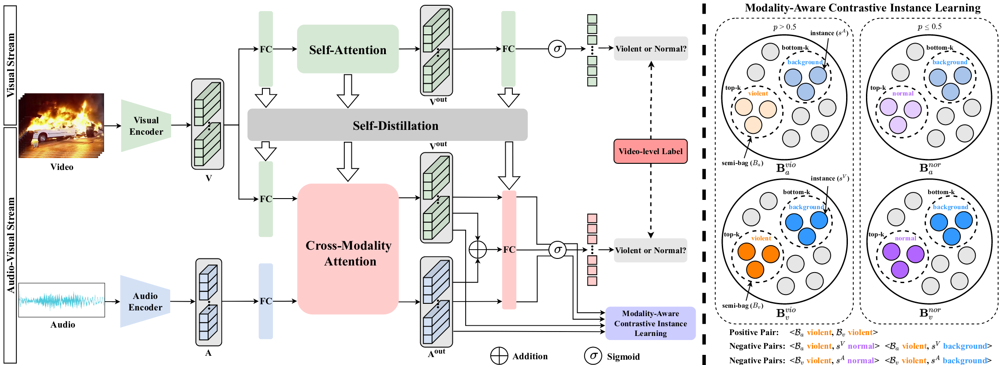
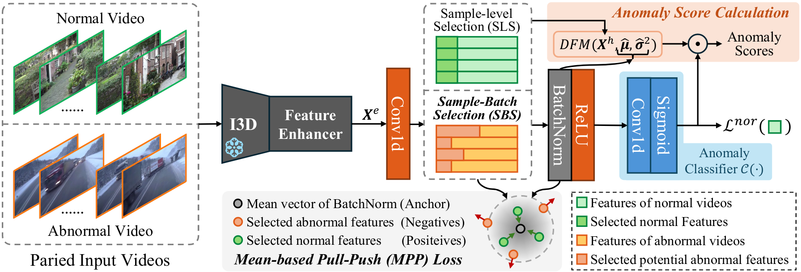

# Datasets

[//]: HTTPS

 
  
 legend 
 

- Weak: Train: Video-Level // Test: Frame-Level
- TS: TimeStamps (transforming to FL is possible, so basicaly TS=FL)

 

<!-- https://ryozomasukawa.github.io/PV-VTT.github.io/# -->
<table><thead>
  <tr>
    <th rowspan="2">Year</th>
    <th rowspan="2">Dataset  </th>
    <th rowspan="2">Details </th>
    <th colspan="2" style="text-align: center">Video</th>
    <th rowspan="2"># Anomaly</th>
    <th colspan="7" style="text-align: center">Annotations</th>
  </tr>
  <tr>
    <th>#V/Th</th>
    <th>Audio</th>
    <th></th>
    <th>Temp</th>
    <th>QA</th>
    <th>Desc</th>
    <th>Judge</th>
    <th>Reas</th>
    <th>CoT</th>
  </tr></thead>
<tbody>
  <tr>
    <td>2018</td>
    <td>UCF-Crime <a href="https://www.crcv.ucf.edu/projects/real-world/">:link:</a> <a href="https://github.com/WaqasSultani/AnomalyDetectionCVPR2018">OG:file_folder:</a> <a href="https://github.com/Roc-Ng/DeepMIL">Torch:file_folder:</a> <a href="https://openaccess.thecvf.com/content_cvpr_2018/papers/Sultani_Real-World_Anomaly_Detection_CVPR_2018_paper.pdf">:newspaper:</a></td>
    <td>
      
 
      
  
 
      

    </td> 
    <td>1900/128h</td>
    <td>-</td>
    <td>13</td>
    <td></td> 
    <td>Weak</td>
    <td></td>
    <td></td>
    <td></td>
    <td></td>
    <td></td>
  </tr>

  <tr>
    <td>2020</td>
    <td>
      XD-Violence <a href="https://roc-ng.github.io/XD-Violence/">:link:</a> <a href="https://github.com/Roc-Ng/XDVioDet">:file_folder:</a>
    </td> 
    <td>
      
 
      
  
 
      

    </td> 
    <td>4754/217h</td>
    <td></td>
    <td>6</td>
    <td></td> 
    <td>Weak</td>
    <td></td>
    <td></td>
    <td></td>
    <td></td>
    <td></td>  
  </tr>

  <tr>
    <td>2024</td>
    <td>Glance VAD <a href="HTTPS">:file_folder:</a> 
    </td>
    <td>
      
 
      
  
 
      

    </td> 
    <td>-</td>
    <td>-</td>
    <td>-</td>
    <td>
      
 
      
  
 
      

    </td>
    <td>Glance</td>
    <td></td>
    <td></td>
    <td></td>
    <td></td>
    <td></td>
  </tr>

  <tr>
    <td>2024</td>
    <td>MSAD <a href="https://msad-dataset.github.io/">:link:</a> </td>
    <td>
      
 
      
  
 
      

    </td> 
    <td>720/4h</td>
    <td></td>
    <td></td>
    <td></td> 
    <td>Weak</td>
    <td></td>
    <td></td>
    <td></td>
    <td></td>
    <td></td>
  </tr>

  <tr>
    <td>2025</td>
    <td>VADD</td>
    <td>
      
 
      
  

      Video Anomaly Detection Dataset is as an extension of UCF-Crime with 2,591
      videos (2,202 train, 389 test) spanning 18 classes, including underrepresented anomalies
      like road accidents and dangerous throwing from UCFC, Throwing Action [119], and newly
      collected accident videos annotated, with video-level labels (train) and frame-level anomaly
      timestamps (test).
      

    </td> 
    <td>2591/-</td>
    <td></td>
    <td>18</td>
    <td></td> 
    <td>Weak</td>
    <td></td>
    <td></td>
    <td></td>
    <td></td>
    <td></td>
  </tr>

  <tr>
    <td>2025</td>
    <td>UCFC-DVS <a href="HTTPS">:file_folder:</a> </td>
    <td>
      
 
      
  
 
      

    </td> 
    <td>-</td>
    <td>-</td>
    <td>13</td>
    <td>
      
 
      
  
 
      

    </td>
    <td>Event</td>
    <td></td>
    <td></td>
    <td></td>
    <td></td>
    <td></td>
  </tr>

  <tr>
    <td>2025</td>
    <td>
      UCFC-HN <a href="HTTPS">:file_folder:</a>  
      MSAD-HN
    </td>
    <td>
      
 
      
  
 
      

      
 
        
  
 
        - 1. Goal: Evaluate model overfitting by generating normal videos with the same scene as abnormal videos.  
        - 2. Steps for Dataset Construction : 
            Step 1: Select one keyframe from Abnormal Train videos of UCF-Crime and MSAD for diffusion models to generate high-quality videos.  
            Step 2: Generate Videos: 
              <!-- Models Used : UCF-HN -> Vidu 2.0 (Vidu platform) with resolution 1088×800 at 32 fps / MSAD-HN -> wan2.1_i2v_480p_14B (ComfyUI) with resolution 832×480 at 16 fps.      -->
              (1) Generate a clip from the selected keyframe; (2) Extend the clip using the last frame of the first clip; (3) Temporally concatenate clips. /// UCF-HN: 15-second sequences. / MSAD-HN: 10-second sequences. /// Manual prompts ensure diverse event representations in generated videos.  
            Step 3: Manually inspect all retained videos for visual fidelity -> Final datasets:  UCF-HN : 100 videos. / MSAD-HN : 67 videos  
          - 3. Validation of Realism :   Visual Comparison (Figure 8(a)): Original anomaly video vs. generated normal counterpart.Violent actions replaced by natural walking, maintaining background coherence.  
            Feature-Space Analysis (Figure 8(b)): Hard negative samples (generated normals) are closer to abnormal videos than original normal videos. //// This indicates higher realism and similarity to abnormal scenes.  
          - 4. Benchmarking: Train models on UCF-Crime or MSAD. Test on corresponding hard normal set (UCF-HN or MSAD-HN). Since all test videos are normal, false alarm rate (FAR)  reflects overfitting degree.
          <!-- 6. Limitations  
            Computational efficiency constraints limit the number of generated videos.
            Complexity of abnormal actions restricts generation of multi-shot videos.
            Excludes XD-Violence due to inability to generate such scenarios. -->
      
      
    </td> 
    <td>-</td>
    <td>-</td>
    <td>-</td>
    <td>
      
 
        
  
 
      
 
      
 
        
  
 
      

    </td>
    <td>-</td>
    <td></td>
    <td></td>
    <td></td>
    <td></td>
    <td></td>
  </tr>  

  <tr>
    <td style="text-align: center; font-weight:bold" colspan="13">VAU</td>
  </tr>

  <tr>
    <td>2024</td>
    <td>HAWK <a href="HTTPS">:file_folder:</a> </td>
    <td>
      
 
      
  
 
      

    </td> 
    <td>7898/142.5h</td>
    <td></td>
    <td>-</td>
    <td>
      <!-- 
 
      
  
 
      
 -->
    </td>
    <td>-</td>
    <td></td>
    <td></td>
    <td></td>
    <td></td>
    <td></td>
  </tr>

  <tr>
    <td>2024</td>
    <td>UCFA <a href="HTTPS">:file_folder:</a> </td>
    <td>
      
 
      
  
 
      UCFA extends UCF-Crime as the first large-scale multimodal dataset for
      Temporal-Specific Video Generation (TSGV), Video Captioning (VC), Dynamic Video Caption-
      ing (DVC), and Multimodal Anomaly Detection (MAD) tasks.   
      Annotated with over 23,000 sentence-level descriptions and 0.1s-precision
      timestamps. It provides 110.7 hours of data with concise, event-specific language.  
      UCFA emphasizes fine-grained temporal grounding and domain relevance, supporting advanced tasks like captioning and query-based retrieval in dynamic, low-quality surveillance contexts. 
      Dataset splits and ethical protocols are included to promote reproducible research. Ethical considerations and dataset splits (train/val/test)
      are detailed to support reproducible, responsible research in this emerging field.
      

    </td> 
    <td>1854/122h</td>
    <td></td>
    <td>13</td>
    <td>
      
 
      
  
 
      

    </td>
    <td>TS</td>
    <td></td>
    <td></td>
    <td></td>
    <td></td>
    <td></td>
  </tr>

  <tr>
    <td>2024</td>
    <td>HIVAU-70k <a href="HTTPS">:link:</a> <a href="HTTPS">:file_folder:</a> 
    <td>      
      
 
      
  
 
      

    </td> 
    <td>5443/-</td>
    <td></td>
    <td></td>
    <td>
      
 
      
  
 
      

      
 
      
  
 
      

      
 
      
  
       
      

      
 
      
  
       
      

    </td>
    <td>FL</td>
    <td></td>
    <td></td>
    <td></td>
    <td></td>
    <td></td>
  </tr>

  <tr>
    <td>2024</td>
    <td>ECVA <a href="https://github.com/fesvhtr/CUVA">:file_folder:</a> <a href="https://github.com/Dulpy/ECVA">:file_folder:</a> </td>
    <td>
      
 
      
  
 
      
  
 
      
  
 
      

    </td> 
    <td>2240/88h</td>
    <td></td>
    <td>100 
      
 
      
  
 
      

    </td>
    <td>
      
 
      
  
 
      

    </td>
    <td>TS</td>
    <td></td>
    <td></td>
    <td></td>
    <td></td>
    <td></td>
  </tr>

  <tr>
    <td>2025</td>
    <td>M-VAE <a href="HTTPS">:file_folder:</a> </td>
    <td>
      
 
      
  
 based on CUVA Q-A tasks (i.e., timestamp, classification, reason, result, and description tasks) 
      1) For abnormal event quadruples:
      from the reason, result, and description tasks in CUVA -> construct initial quadruples through ChatGPT with the instruction: "Please extract the subject, object, and scene of the event based on the responses below"   
      (2) create multiple candidate sets for subjects, objects, and scenes:  
      subjects and objects elements, we manually construct a set of around 40 for subjects and objects and filter elements based on this set.   
      For event types elements, we adopt the 11 categories (i.e., Fighting, Animals, Water, Vandalism, Accidents, Robbery, Theft, Pedestrian, Fire, Violations, and Forbidden) from CUVA as the event types.  
      For scenes elements, we assign two annotators to classify scenes for each abnormal event
      

      
 
      
  
 
      

    </td> 
    <td>1000/32.50h</td>
    <td></td>
    <td></td>
    <td>
      <!-- 
 
      
  
 
      
 -->
    </td>
    <td>FL</td>
    <td></td>
    <td></td>
    <td></td>
    <td></td>
    <td></td>
  </tr>

  <tr>
    <td>2025</td>
    <td>UCFVL</td>
    <td>
      
 
      
  
 
      

    </td> 
    <td>1699/88.2h</td>
    <td></td>
    <td></td>
    <td>
      
 
      
  
 
      

    </td>
    <td>TS</td>
    <td></td>
    <td></td>
    <td></td>
    <td></td>
    <td></td>
  </tr>

  <tr>
    <td>2025</td>
    <td>VANE <a href="HTTPS">:file_folder:</a> </td>
    <td>
      
 
      
  
 
      

    </td> 
    <td>325/-</td>
    <td></td>
    <td>9</td>
    <td>
      
 
      
  
 
      

    </td>
    <td>TS</td>
    <td></td>
    <td></td>
    <td></td>
    <td></td>
    <td></td>
  </tr>

  <tr>
    <td>2025</td>
    <td>SurveillanceVQA-589K <a href="HTTPS">:file_folder:</a> </td>
    <td>
      
 
      
  
 
      
  
 
      

    </td> 
    <td>3030/159h</td>
    <td></td>
    <td>18
      
 
      
  
 UCFC + Fire, Object/People Falling, Pursuit, Water Incidents
      

    </td>
    <td>
      
 
      
  
 
      

    </td>
    <td>FL</td>
    <td></td>
    <td></td>
    <td></td>
    <td></td>
    <td></td>
  </tr>

  <tr>
    <td>2025</td>
    <td>
    Vad-Reasoning-SFT  
    Vad-Reasoning-RL  
    Vad-Reasoning 
    </td>
    <td>
      
 
      
  

      evaluation metrics: QA  2 accuracy, temporal Intersection-over-Union (IoU), GPT-based reasoning score, and classification accuracy
      

      
 
      
 
 
      
 Annot Proce  
 
      
  
 
      

    </td> 
    <td>2193/88.3h   6448/272.2h   8641/360.5h </td>
    <td></td>
    <td>37 VL 
 
  
 
 </td>
    <td>
      
 
      
  
 
      

    </td>
    <td>TS</td>
    <td></td>
    <td></td>
    <td></td>
    <td></td>
    <td></td>
  </tr>

  <tr>
    <td>2025</td>
    <td>VAU-Bench (VAUR1) </td>
    </td>
    <td>
      
 
      
  
 
      VAU benchmark is designed for Chain-of-Thought reasoning 
      built from MSAD, UCFC and ECVA, enriched with Chain-of-Thought (CoT) annotations. 
      For HIVAU-70K_UCFC and ECVA: DeepSeek-V3 -> video-level summaries, QA pairs, and reasoning chains.  
      For MSAD, CoT annotations done through: 
        (1) InternVL-8B-MPO generate initial captions/QA/step-step reasoning; 
        (2) DeepSeek-V3 verifies/refines 
      1.5 million words of fine-grained textual annotations, averaging 337 words per video -> descriptions, reasoning rationales, and MCQ 
      split: 2,939 training, 734 validation, and 929 test  
      3,700 temporal annotations to support the anomaly grounding task. 
      

      
 
      
  
 
      

    </td>
    <td>4602/169.1h</td>
    <td></td>
    <td></td>
    <td>
      
 
      
  
 
      

    </td>
    <td>TS</td>
    <td></td>
    <td></td>
    <td></td>
    <td></td>
    <td></td>
  </tr>

  <tr>
    <td></td>
    <td></td>
    <td></td>
    <td></td>
    <td></td>
    <td></td>
    <td></td>
    <td></td>
    <td></td>
    <td></td>
    <td></td>
    <td></td>
    <td></td>
  </tr>

  <tr>
    <td></td>
    <td>TAU-106K <a href="https://github.com/cool-xuan/TABot">:file_folder:</a> </td>
    <td></td>
    <td></td>
    <td></td>
    <td></td>
    <td></td>
    <td></td>
    <td></td>
    <td></td>
    <td></td>
    <td></td>
    <td></td>
  </tr>

  <tr>
    <td></td>
    <td>___<a href="HTTPS">:link:</a> </td>
    <td></td>
    <td></td>
    <td></td>
    <td></td>
    <td></td>
    <td></td>
    <td></td>
    <td></td>
    <td></td>
    <td></td>
    <td></td>
  </tr>
</tbody></table>

> [!important]
> **WIP** For a more detailed information/stats about datasets refer to [Awesome-Video-Anomaly-Detection](https://github.com/Junxi-Chen/Awesome-Video-Anomaly-Detection/tree/main) by [@Junxi-Chen](https://github.com/Junxi-Chen)

<!---
UCA [62] only provides clip-level captions, overlooking the understanding of anomalies across longer time spans. 
CUVA [9] and Hawk [45], on the other hand, only offer video-level instruction data, neglecting finer-grained visual perception and anomaly analysis. 
Our proposed HIVAU-70k takes a multi-temporal granularity perspective. It enables progressive and comprehensive learning, from short-term visual perception to long-term anomaly reasoning.

Methods,#Catogories,#Samples,Text(clip-level,event-level,video-level),TempAnno,MLLM-tuning  
UCA,13,23542,✓,✗,✗,✓,✗
LAVAD,N/A,N/A,✓,✗,✓,✗,✗
VAD-VideoLLama,13/7,2400,✗,✗,✓,✗,projection
CUVA,11,6000,✗,✗,✓,✗,✗ 
Hawk/-/16000,✗,✗,✓,✗,projection 
HIVAU-70k, 19,70000,✓,✓,✓,✓,LoRA

-->

# Eval Metrics

<!-- 

% UCFA
    Temporal Sentence Grounding in Videos
    R@K for IoU=θ is commonly adopted as the evaluation metric to measure the performance in TSGV. It is defined as the percentage of at least one of the top-K predicted moments that have IoU with ground-truth moment larger than θ [12]. In the following, we set R@K for IoU= θ with K = 1, 5 and θ = 0.3, 0.5, 0.7 as the evaluation metric.
    Video Captioning
    We use the metrics as in [22, 33]. The evaluation metrics of correctness include Bilingual Evaluation Understudy (BLEU) [B@n, n=1,2,3,4] [29], Metric for Evaluation of Translation with Explicit Ordering (METEOR) [M] [11], Recall Oriented Understudy of Gisting Evaluation (ROUGE-L) [R] [21], and Consensus-based Image Description Evaluation (CIDEr) [C] [40].
    Dense Video Captioning
    We have assessed the performance from two perspectives. For localization performance, we employed the evaluation tools provided by the ActivityNet Captions Challenge 2018 and used the common metrics [43, 50], like different IoU thresholds (0.3, 0.5, 0.7, 0.9), classic caption evaluation metrics: BLEU, METEOR, CIDEr, and the performance in describing video stories: SODA_c score.

    % MSAD
    Micro-AUC and Macro-AUC. The former concatenates the frames from all the videos and computes the overall AUC value, and the latter computes the AUC value for each video and averages it. 
    For pixel-level annotations, Ramachandra et al. [67] introduced two evaluation metrics: the RegionBased Detection Criterion (RBDC) and the Track-Based Detection Criterion (TBDC). These metrics are designed to prioritize the false positive rate on both temporal and spatial dimensions. This consideration stems from the fact that anomalies in videos often extend across multiple frames. Hence, detecting anomalies in any segment and reducing the false detection rate holds significance for VAD systems.
    
    % sherlock/m-vae
    For localization performance, we use the mAP@tIoU metric [71], calculated by mean Average Precision (mAP) at different IoU thresholds from 0.1 to 0.3 with 0.1 intervals. For classification performance, we refer to the traditional anomaly classification task [17, 45, 61] for anomaly classification metric, which mainly determines whether each video frame is abnormal or not in the video. We prefer Recall over Precision and report F2 [71] as another classification metric. Furthermore, our model focuses on accurately distinguishing abnormal events. As shown in Figure 1, it’s better to mark all timestamps as abnormal than to miss any. So we prioritize false negative rates (FNRs): FNRs = num of false-negative frame  num of positive frame , which is the rate of mislabeling an abnormal event frame as normal. In addition, t-test is used to evaluate the significance of the performance.
    
    % PLOVAD 
    For detection, following previous works [1], [4], the framelevel area under the ROC curve(AUC) is adopted as the evaluation metric for UCF-Crime, ShanghaiTech and UBnormal. A higher AUC indicates superior detection performance. For XD-Violence, we utilize AUC of the frame-level precisionrecall curve (AP), following [58].  
    For categorization, the Multi-class AUC for individual classes is computed, and their macro mean, termed mAUC,is derived as the evaluation metric. Multi-class AUC [60] is computed using the one-vs-rest approach, treating each class in turn as positive and others as negative.  mAUC = 1  K  K  X  k=1  AUCk (15)  where K is the number of classes, AUCk is AUC for class k, considering class k as positive and others as negative. Additionally, Top-1 accuracy and Top-5 accuracy are utilized for the evaluation of categorization performance, in accordance with the standard evaluation protocol for video action classification [41].

 -->

# Methodos 
Below are the collected works (mainly) under Weakly supervision (UCFC/XDV), but also new benchamrks.

<u> Recomended</u> to have this extension for redabiliity purposes [wide-github](https://github.com/xthexder/wide-github) + zoom to [60-80]%. 

 
  
 legend 
 

<!-- 

 
[?logo=pytorch)](#)
[?logo=arxiv&logoColor=red)](#)  
-->

-  Dataset/Benchmark release paper   

-   Train: Video-Level (VL) labelling, either binary or class // Test: Frame-Level (FL) <!-- Orange -->

-  *For each abnormal video in the training set, a randomly chosen single-frame click gi is provided between the start si and end ei of each abnormal instance (si < gi < ei).*

-  = Zero-Shot <!-- Gray -->

-  Evaluation on novel anomalies
<!-- Deep Sky Blue -->

<!-- -  -->

-  Provide a mapping of detected visual anomalies to textual descriptions or semantic cues, using either ditionary, LLM's insights or VLM's textual explanations.

- 
  - Badge is a link to file implementing the method (or better be config since it contains everything).

- Feature in yellow means authors have provided download info

- CLIP: if not mentioned refers to ViT B/16

 

<!--  -->

<!--

 legend 

   
 
 
 

?logo=github&logoColor=green)
-->

## UCFC/XDV

  Results refer to the test subset which methods were evaluated, *o(verall)/a(nomaly)*, when provided. 

  *AUC@ROC* / *AveragePrecision* / *FalseAlarmRate* 

  The *mAP@IoU* is the average value of the mean AP under diff intersection over union (IoU) thresholds ([0.1,0.5] w/ stride=0.1) (multi-class classification)

<table><thead>
  <tr>
    <th>Year</th>
    <th>Method</th>
    <th>Code</th>
    <th>Pipeline & Anom Criterion</th>
    <th>Supervision</th>
    <th>Feature</th>
    <th>UCF  (AUCo/AUCa/FAR/mAP@IoU)</th>
    <th>XDV  (APo/APa/FAR/mAP@IoU)</th>
  </tr></thead>
<tbody>
  <tr>
    <td>2018</td>
    <td>MIR    
         
    </td>
    <td> 
      
      
    </td>
    <td> 
 

  
  </td>
    <td></td>
    <td>C3D I3D</td>
    <td>75.41 77.92</td>
    <td> </td>
  </tr>
  <tr>
    <td>2019</td>
    <td>GCN </td>
    <td>  </td>
    <td> 
 

  
  </td>
    <td></td>
    <td>C3D TSN</td>
    <td>81.92 82.12</td>
    <td> </td>
  </tr>
  <tr>
    <td>2019</td>
    <td>MA </td>
    <td></td>
    <td></td>
    <td></td>
    <td>PWC-OF</td>
    <td>72.10</td>
    <td></td>
  </tr>
  <tr>
    <td>2019</td>
    <td>TCN </td>
    <td></td>
    <td> 
 

  
  </td>
    <td></td>
    <td>C3D </td>
    <td>78.66</td>
    <td></td>
  </tr>
  <tr>
    <td>2020</td>
    <td>SRF </td>
    <td></td>
    <td> 
 

  
  </td>
    <td></td>
    <td>C3D </td>
    <td>79.54/-/0.13</td>
    <td></td>
  </tr>
  <tr>
    <td>2020</td>
    <td>ARN </td> 
    <td></td>
    <td> </td>
    <td></td>
    <td>I3D </td>
    <td>75.71</td>
    <td></td>
  </tr>
  <tr>
    <td>2020</td>
    <td>HLN 
        
      
    </td>
    <td></td>
    <td> 
 

  
  </td>
    <td></td>
    <td>I3D I3D+VGG </td> 
    <td>82.44 -</td>
    <td>- 78.64</td>
  </tr>
  <tr>
    <td>2020</td>
    <td>WSAL </td>
    <td>  </td>
    <td> 
 

  
  </td>
    <td></td>
    <td>I3D  R(2+1)D TSN</td>
    <td>74.18   75.29   85.38/67.38/-</td>
    <td>      </td>
  </tr>
  <tr>
    <td>2020</td>
    <td>CLAWS </td>
    <td></td>
    <td> 
 

  
  </td>
    <td></td>
    <td>C3D</td>
    <td>83.03/-/0.12</td>
    <td></td>
  </tr>
  <tr>
    <td>2021</td>
    <td>MIST </td>
    <td></td>
    <td> 
 

  
  </td>
    <td></td>
    <td>C3D  I3D</td>
    <td>81.40/-/2.19   82.30/-/0.13</td>
    <td>   </td>
  </tr>
  <tr>
    <td>2021</td>
    <td>AVF </td>
    <td></td>
    <td> 
 

  
  </td>
    <td></td>
    <td>I3D+VGG</td>
    <td></td>
    <td>81.69</td>
  </tr>
  <tr>
    <td>2021</td>
    <td>RTFM  </td>
    <td> 
       
       
    </td>
    <td> 
 

  
  </td>
    <td></td>
    <td>C3D  I3D</td>
    <td>83.28   84.30</td>
    <td>75.89   77.81</td>
  </tr>
  <tr>
    <td>2021</td>
    <td>XEL  </td>
    <td>
      
        
    </td>
    <td> 
 

  
  </td>
    <td></td>
    <td>C3D</td>
    <td>82.60</td>
    <td></td>
  </tr>
  <tr>
    <td>2021</td>
    <td>CA  </td>
    <td></td>
    <td> 
 

  
  </td>
    <td></td>
    <td>C3D  TSN  I3D </td>
    <td>83.40   83.52   84.62</td>
    <td>      76.90</td>
  </tr>
  <tr>
    <td>2021</td>
    <td>MS-BS  </td>
    <td></td>
    <td> 
 

  
  </td>
    <td></td>
    <td>I3D</td>
    <td>83.53</td>
    <td></td>
  </tr>
  <tr>
    <td>2021</td> 
    <td>DAM </td>
    <td>
      
    </td>
    <td> 
 

  
  </td>
    <td></td>
    <td>I3D</td>
    <td>82.67/-/0.3</td>
    <td></td>
  </tr>
  <tr>
    <td>2022</td>
    <td>CMALA  
    <td>
       
      </td>
    </td>
    <td> 
 

  
  </td>
    <td></td>
    <td>I3D+VGG</td>
    <td></td>
    <td>83.54</td>
  </tr>
  <tr>
    <td>2022</td>
    <td>CLAWS+ </td>
    <td></td>
    <td></td>
    <td></td>
    <td>C3D  3DRN </td>
    <td>83.37/-/0.11   84.16/-/0.09</td>
    <td>   </td>
  </tr>
  <tr>
    <td>2022</td>
    <td>WSTR </td>
    <td> </td>
    <td> 
 

  
  </td>
    <td></td>
    <td>I3D </td>
    <td>83.17</td>
    <td></td>
  </tr>
  <tr>
    <td>2022</td>
    <td>STA </td>
    <td></td>
    <td> 
 

  
  </td>
    <td></td>
    <td>C3D I3D</td>
    <td>81.60   83.00</td>
    <td>   </td>
  </tr>
  <tr>
    <td>2022</td>
    <td>MSL </td>
    <td> </td>
    <td> 
 

  
  </td>
    <td></td>
    <td>C3D  I3D  VSWIN</td>
    <td>82.85   85.30   85.62</td>
    <td>75.53   78.28   78.59</td>
  </tr>
  <tr>
    <td>2022</td>
    <td>SGMIR </td>
    <td></td>
    <td> 
 

  
  </td>
    <td></td>
    <td>I3D</td>
    <td>81.70</td>
    <td></td>
  </tr>
  <tr>
    <td>2022</td>
    <td>TCA </td>
    <td></td>
    <td> 
 

  
  </td>
    <td></td>
    <td>C3D  I3D</td>
    <td>82.08/-/0.11   83.75/-/0.05</td>
    <td>   </td>
  </tr>
  <tr>
    <td>2022</td>
    <td>MACILSD  </td>
    <td>
       
      
    </td>
    <td> 
 

  
  </td>
    <td></td>
    <td>I3D+VGG </td>
    <td></td>
    <td>83.40</td>
  </tr>
  <tr>
    <td>2022</td>
    <td>LAN </td>
    <td></td>
    <td> 
 

  
  </td>
    <td></td>
    <td>I3D </td>
    <td>85.12</td>
    <td>80.72</td>
  </tr>
  <tr>
    <td>2022</td>
    <td>OpenVAD   </td>
    <td></td>
    <td> 
      
      
 

  
  </td>
    <td></td>
    <td></td>
    <td></td>
    <td></td>
  </tr>
  <tr>
    <td>2022</td>
    <td>ANM  </td>
    <td>
       
      
    </td>
    <td> 
 

  
  </td>
    <td></td>
    <td>I3D  I3D+VGG</td>
    <td>82.99   </td>
    <td>   84.91</td>
  </tr>
  <tr>
    <td>2022</td>
    <td>MSAF  </td>
    <td></td>
    <td> 
 

  
  </td>
    <td></td>
    <td>I3D+OF  I3D+OF+VGG</td>
    <td>81.34   </td>
    <td>   80.51</td>
  </tr>
  <tr>
    <td>2022</td>
    <td>TAI </td>
    <td></td>
    <td> 
 

  
  </td>
    <td></td>
    <td>I3D</td>
    <td>85.73</td>
    <td></td>
  </tr>
  <tr>
    <td>2022</td>
    <td>BSME </td>
    <td></td>
    <td> 
 

  
  </td>
    <td></td>
    <td>I3D</td>
    <td>83.63</td>
    <td></td>
  </tr>
  <tr>
    <td>2022</td>
    <td>MGFN  </td>
    <td>
       
      
    </td>
    <td> 
 

  
  </td>
    <td></td>
    <td>I3D  VSwin</td>
    <td>86.98   86.67</td>
    <td>79.19   80.11</td>
  </tr>
  <tr>
    <td>2022</td>
    <td>CUN </td>
    <td> </td>
    <td> 
 

  
  </td>
    <td></td>
    <td>I3D  I3D+VGG </td>
    <td>86.22   </td>
    <td>78.74   81.43</td>
  </tr>
  <tr>
    <td>2022</td>
    <td>CLIP-TSA   </td>
    <td>
      
      
    </td>
    <td> 
 

  
  </td>
    <td></td>
    <td style="color:yellow">CLIP</td>
    <td>87.58</td>
    <td>82.19</td>
  </tr>
  <tr>
    <td>2023</td>
    <td>NGMIL </td>
    <td></td>
    <td> 
 

  
  </td>
    <td></td>
    <td>C3D  I3D </td>
    <td>83.43   85.63</td>
    <td>75.91   78.51</td>
  </tr>
  <tr>
    <td>2023</td>
    <td>URDMU   </td>
    <td>
      
      
    </td>
    <td> 
 

  
  </td>
    <td></td>
    <td>I3D  I3D+VGG</td>
    <td>86.97/-/1.05   </td>
    <td>81.66/-/0.65   81.77</td>
  </tr>
  <tr>
    <td>2023</td>
    <td>UMIL </td>
    <td> </td>
    <td> 
 

  
  </td>
    <td></td>
    <td>X-CLIP</td>
    <td>86.75/68.68/-</td>
    <td></td>
  </tr>
  <tr>
    <td>2023</td>
    <td>LSTC  </td>
    <td></td>
    <td> 
 

  
  </td>
    <td></td>
    <td>C3D I3D </td>
    <td>83.47   85.88</td>
    <td>   </td>
  </tr>
  <tr>
    <td>2023</td>
    <td>BERTMIL </td>
    <td> </td>
    <td> 
 

  
  </td>
    <td></td>
    <td>I3D+FLOW  I3D </td>
    <td>86.71   </td>
    <td>   82.10</td>
  </tr>
  <tr>
    <td>2023</td>
    <td>TEVAD </td>
    <td> </td>
    <td> 
 

  
  </td>
    <td></td>
    <td></td>
    <td></td>
    <td></td>
  </tr>
  <tr>
    <td>2023</td>
    <td>HYPERVD  </td>
    <td></td>
    <td> 
 

  
  </td>
    <td></td>
    <td>I3D+VGG </td>
    <td></td>
    <td>85.67</td>
  </tr>
  <tr>
    <td>2023</td>
    <td>PEL4VAD   </td>
    <td>
      
       
    </td>
    <td> 
 

  
  </td>
    <td></td>
    <td>I3D </td>
    <td>86.76/72.24/0.43</td>
    <td>85.59/70.26/0.57</td>
  </tr>
  <tr>
    <td>2023</td>
    <td>VAR  </td>
    <td>  </td>
    <td> 
 

  
  </td>
    <td></td>
    <td></td>
    <td></td>
    <td></td>
  </tr>
  <tr>
    <td>2023</td>
    <td>CNN-VIT </td>
    <td></td>
    <td> 
 

  
  </td>
    <td></td>
    <td>C3D  I3D  CLIP  C3D+CLIP I3D+CLIP </td>
    <td>85.78   86.50   87.63   88.02   88.97</td>
    <td>            </td>
  </tr>
  <tr>
    <td>2024</td>
    <td>TeD-SPAD  </td>
    <td>
      
      <a href="https://joefioresi718.github.io/TeD-SPAD_webpage/">:link:</a>
    </td>
    <td> 
 

  
  </td>
    <td></td>
    <td></td>
    <td></td>
    <td></td>
  </tr> 
  <tr>
    <td>2023</td>
    <td>SAA  </td>
    <td>
       
       
        
       
    </td>
    <td> 
 

  
  </td>
    <td></td>
    <td>I3D  I3D+VGG </td>
    <td>86.19/68.77/-   </td>
    <td>83.59/84.19/-   84.23</td>
  </tr>
  <tr>
    <td>2023</td>
    <td>AnomalyCLIP </td>
    <td>  </td>
    <td> 
 

  
  </td>
    <td></td>
    <td>ViT-B/16 </td>
    <td>86.36</td>
    <td>78.51</td>
  </tr>
  <tr>
    <td>2023</td>
    <td>MTDA </td>
    <td></td>
    <td> 
 

  
  </td>
    <td></td>
    <td>I3D+VGG </td>
    <td></td>
    <td>84.44</td>
  </tr>
  <tr>
    <td>2023</td>
    <td>BNWVAD   </td>
    <td>
      
      
    </td>
    <td> 
 

  
  </td>
    <td></td>
    <td>I3D  I3D+VGG </td>
    <td>87.24/71.71/-   </td>
    <td>84.93/85.45/-   85.26</td>
  </tr>
  <tr>
    <td>2023</td>
    <td>DEN  </td>
    <td>
      
       
    </td>
    <td> 
 

  
  </td>
    <td></td>
    <td>I3D  I3D+VGG </td>
    <td>86.33   </td>
    <td>81.66   83.13</td>
  </tr>
  <tr>
    <td>2023</td>
    <td>VADCLIP    </td>
    <td>
      
      
    </td>
    <td>
      
 

  
  
    </td>
    <td>
      
    </td>
    <td style="color:yellow">CLIP</td>
    <td>88.02/70.23/-/6.68</td>
    <td>84.51/-/-/24.70</td>
  </tr>
  <tr>
    <td>2024</td>
    <td>REWARD
      <a href="http://arxiv.org/abs/">
      <td> </td>
    </td>
    <td> 
 

  
</td>
    <td>
      
    </td>
    <td></td>
    <td></td>
    <td></td>
  </tr> 
  <tr>
    <td>2024</td>
    <td>VAD-LLaMA  </td>
    <td>  </td>
    <td> 
      
      
 

  
  
    </td>
    <td>
      
    </td>
    <td>Video-LLaMA(I+T)</td>
    <td>88.13/71.12/-</td>
    <td></td>
  </tr>
  <tr>
    <td>2024</td>
    <td>LAP </td>
    <td></td>
    <td> 
 

  
  </td>
    <td>
      
    </td>
    <td>CLIP+SwinBERT</td>
    <td>87.7/71.1</td>
    <td>82.6</td>
  </tr>
  <tr>
    <td>2024</td>
    <td>  </td>
    <td> 
       
      
    </td>
    <td> 
      
 

  
  
    </td>
    <td>
      
    </td>
    <td>I3D</td>
    <td>MIL 87.30/71.07   RTFM 87.80/75.16   URDMU 91.96/84.94</td>
    <td>MIL 83.61/86.15   RTFM 86.88/86.65   URDMU 89.40/89.85</td>
  </tr>
    <tr>
    <td>2024 </td>
    <td>OVVAD </td>
    <td></td>
    <td> 
       
      
 

  
  
    </td>
    <td>  </td>
    <td>CLIP</td>
    <td>86.40/88.20/-</td>
    <td>66.53/76.03/-</td>
  </tr>
  <tr>
    <td>2024</td>
    <td>LAVAD </td>
    <td>   </td>
    <td>
        
       
      
 

  
 
    </td>
    <td></td>
    <td> BLIP-2 ensmb   Llama-2-13b-chat   ImageBind MM enc. </td>
    <td>80.28</td>
    <td>62.01</td>
  </tr>
  <tr>
    <td>2024</td>
    <td>TPWNG </td>
    <td>
      
    </td>
    <td> 
 

  
  </td>
    <td>
      
    </td>
    <td>CLIP(I+T)</td>
    <td>87.79</td>
    <td>83.68</td>
  </tr>
  <tr>
    <td>2024</td>
    <td>MSBT </td>
    <td>  </td>
    <td> 
 

  
  </td>
    <td>
      
    </td>
    <td>I3D+VGG  I3D+VGG+TV-L1 </td>
    <td>   </td>
    <td>82.54   84.32</td>
  </tr>
  <tr>
    <td>2024</td>
    <td> 
       
    </td>
    <td> 
       
      
    </td>
    <td> 
       
      
 

  
  
    </td>
    <td></td>
    <td>BLIP2 EVACLIP+QFORMER</td>
    <td></td>
    <td></td>
  </tr>
  <tr>
    <td>2024</td>
    <td>PEMIL   </td>
    <td>
      
      
    </td>
    <td>
      
 

  
 
    </td>
    <td>
      
    </td>
    <td>I3D I3D+VGG</td>
    <td>86.83</td>
    <td>88.05   88.21</td>
  </tr>
  <tr>
    <td>2024</td>
    <td>  </td>
    <td>
        
    </td>
    <td> 
       
      
 

  
          
    </td>
    <td> </td> 
    <td></td>
    <td></td>
    <td></td>
    <td></td>
  </tr> 
  <tr>
    <td>2024</td>
    <td>Holmes-VAD 
       
      <a href="https://holmesvad.github.io/"> :link: </a> 
    </td>
    <td> </td>
    <td> 
       
      
 

  
  
    </td>
    <td>  
       + 
      
    </td>
    <td>LanguageBind+ URDMU+ VideoLLaVA </td>
    <td>89.51</td>
    <td>90.67</td>
  </tr>
  <tr>  
    <td>2024</td>
    <td>Holmes-VAU  
         
      
    </td>
    <td>
      
      
    </td>
    <td>
       
      
 

  

    </td>
    <td>  
       + 
      
    </td>
    <td>InternVL2-2B (I+T)</td>
    <td>88.96</td>
    <td>87.68</td>
  </tr>
  <tr>
    <td>2024</td>
    <td>FE-VAD </td>
    <td>
      
      
    </td>
    <td> 
 

  
   </td>
    <td>
      
    </td>
    <td>I3D</td>
    <td>87.13</td>
    <td>82.87</td>
  </tr>
  <tr>
    <td>2024</td>
    <td>STPrompt
       
    </td>
    <td> </td>
    <td> 
 

  
</td>
    <td>
      
    </td>
    <td>CLIP(I+T)</td>
    <td>88.08</td>
    <td></td>
  </tr>
  <tr>
    <td>2024</td>
    <td>ITC
       
    </td>
    <td></td>
    <td> 
 

  
</td>
    <td>
      
    </td>
    <td>CLIP(I+T)</td>
    <td>89.04/-/-/7.90</td>
    <td>85.45/-/-/26.83</td>
  </tr>
  <tr>
    <td>2024</td>
    <td>TDSD
       
    </td>
    <td>  </td>
    <td> 
 

  
</td>
    <td>
      
    </td>
    <td>CLIP(I+T) (ViT-L/14)</td>
    <td></td>
    <td>84.69</td>
  </tr>
  <tr>
    <td>2024</td>
    <td> 
      
    </td>
    <td>
       
      
    </td>
    <td> 
      <!-- 
 

  
 -->
    </td>
    <td></td>
    <td></td>
    <td></td>
    <td></td>
  </tr>
  <tr>
    <td>2024</td>
    <td>AnomShield 
        
      
    </td>
    <td>
       
      
    </td>
    <td>
      
      
 

  

    </td>
    <td></td>
    <td></td>
    <td></td>
    <td></td>
  </tr>
    <tr>
    <td>2024</td>
    <td>QuoVADis  </td>
    <td></td>
    <td></td>
    <td></td>
    <td></td>
    <td></td>
    <td></td>
  </tr>
  <tr>
    <td>2025</td>
    <td>AVCL
       
    </td>
    <td>
      <!--   -->
      
    </td>
    <td> 
        
      
 

  

    </td>
    <td>
      
    </td>
    <td>I3D+VGG I3D+VGG(+MACILSD)</td>
    <td></td>
    <td>81.11 83.98</td>
  </tr>
  <tr>
    <td>2025</td>
    <td>PLOVAD   </td>
        <td></td>
    <td> 
        
      <!--  -->
      
 

  
  
    </td>
    <td></td>
    <td>CLIP(I+T)</td>
    <td>87.06</td>
    <td></td>
  </tr>
    <tr>
    <td>2024</td>
    <td> 
      
      <!-- <a href="https://msad-dataset.github.io/"> :link: </a> -->
    </td>
    <td>
      <!--   -->
      <!--  -->
    </td>
    <td> 
      <!-- 
 

  
 -->
    </td>
    <td></td>
    <td></td>
    <td></td>
    <td></td>
  </tr>
  <tr>
    <td>2025</td>
    <td>MTFL </a>  </td>
    <td></td>
    <td> 
 

  
 </td>
    <td></td>
    <td>VST VSTAug</td>
    <td>87.16 89.78</td>
    <td>84.57 79.40</td>
  </tr>
  <tr>
    <td>2025</td>
    <td>   </td>
    <td> 
    </td>
    <td>
       
      
 

  
  </td>
    <td></td>
    <td></td>
    <td></td>
    <td></td>
  </tr>
  <tr>
    <td>2025</td>
    <td> MSTAgentVAD
      <a href="https://www.sciencedirect.com/science/article/pii/S0957417425007766">
      <td> </td>
    </td>
    <td> 
 

  
</td>
    <td></td>
    <td>VidSwinT</td>
    <td>89.27/-/0.0017</td>
    <td></td>
  </tr>
  <tr>
    <td>2025</td>
    <td>   </td>
    <td> 
      
      
    </td>
    <td> 
 

  
  </td>
    <td></td>
    <td>Spikingformer (PT@HarDVS)</td>
    <td>65.01/-/3.27</td>
    <td></td>
  </tr>
  <tr>
    <td>2025</td>
    <td>
       
    </td>
    <td> </td>
    <td> 
      <!-- 
 

  
 -->
    </td>
    <td></td>
    <td></td>
    <td></td>
    <td></td>
  </tr>
  <tr>
    <td>2025</td>
    <td>VADMamba 
      
    </td>
    <td>
       
    </td>
    <td> 
      
 

  

    </td>
    <td></td>
    <td>-</td>
    <td>-</td>
    <td>-</td>
  </tr>
  <tr>
    <td>2025</td>
    <td>VERA </td>
    <td>    </td>
    <td> 
      
      
 

  
   
      
 

  
 
      
 

  
 
    </td>
    <td>
      
    </td>
    <td>InternVL2-8B</td>
    <td>86.55</td>
    <td>70.54</td>
  </tr>
    <tr>
    <td>2025</td>
    <td>MELOW
       
    </td>
    <td>
      <!--   -->
      
    </td>
    <td> 
        
      
 

  

    </td>
    <td>
      
    </td>
    <td>CLIP(I+T)</td>
    <td>87.80</td>
    <td>85.13</td>
  </tr>
  <tr>
    <td>2025</td>
    <td>AVadCLIP </td>
    <td> 
      <!--  -->
      
    </td>
    <td> 
      
 

  
 
    </td>
    <td>
      
    </td>
    <td>CLIP(I+T) CLIP(I+T)+Wav2CLIP</td>
    <td></td>
    <td>85.53/-/-/27.44 86.04/-/-/28.61</td>
  </tr>
  <tr>
    <td>2025</td>
    <td>EventVAD  </td>
    <td></td>
    <td>
        
      
      
 

  
  
    </td>
    <td>
      
    </td>
    <td>EVA-CLIP+ RAFT+ VideoLLaMA2.1-7B-16F</td>
    <td>82.03</td>
    <td>64.04</td>
  </tr>
  <tr>
    <td>2025</td>
    <td>LPG
       
    </td>
    <td> </td>
    <td> 
 

  
</td>
    <td></td>
    <td>YOLOv7+ BLIP-2(I+T)</td>
    <td>?</td>
    <td>?</td>
  </tr>
  <tr>
    <td>2025</td>
    <td>ProDisc-VAD  </td>
    <td>
       
      
    </td>
    <td> 
 

  
  </td>
    <td></td>
    <td>CLIP</td>
    <td>87.12</td>
    <td></td>
  </tr>
  <tr>
    <td>2025</td>
    <td>   </td>
    <td>
       
      
    </td>
    <td> 
      <!-- 
 

  
 -->
    </td>
    <td></td>
    <td></td>
    <td></td>
    <td></td>
  </tr>
    <tr>
    <td>2025</td>
    <td>PiVAD  </td>
    <td>
       
      
    </td>
    <td> 
 

  
</td>
    <td>
      <!--    -->
      
    </td>
    <td>(TRAIN) YOLOV7-pose+ DepthAnythingV2+ SAM+RAFT+VifiCLIP (INFER) I3D</td>
    <td>90.33/77.77 </td>
    <td>85.37/85.79</td>
  </tr>
  <tr>
    <td>2025</td>
    <td>Flashback
       
    </td>
    <td>
      
    </td>
    <td> 
        
      
      
 

  

    </td>
    <td>
      
    </td>
    <td>PerceptionEncoder(I+T)</td>
    <td>87.29</td>
    <td>75.13</td>
  </tr>
    <tr>
    <td>2025</td>
    <td> LaAP
      <a href="http://arxiv.org/abs/2505.19022">  
      
    </td>
    <td> 
      
    </td>
    <td> 
      
 
        
metrics
 
         
         
      

      
 
        
results
 
         
         
      

    </td>
    <td></td>
    <td></td>
    <td></td>
    <td></td>
  </tr> 
    <tr>
    <td>2025</td>
    <td> VAD-R1
      <a href="http://arxiv.org/abs/2505.19877">
      <td> </td>
    </td>
    <td> 
      
      
 
      

  
      

    </td>
    <td></td>
    <td></td>
    <td></td>
    <td></td>
  </tr> 
  <tr>
    <td>2025</td>
    <td> VAU-R1
      <a href=" http://arxiv.org/abs/2505.23504">
    </td>
    <td> 
      
    </td>
    <td> 
      
      
 

  

    </td>
    <td></td>
    <td></td>
    <td></td>
    <td></td>
  </tr> 
  <tr>
    <td></td>
    <td></td>
    <td></td>
    <td></td>
    <td></td>
    <td></td>
    <td></td>
    <td></td>
  </tr> 

  <tr>
    <td>2025</td>
    <td> FEDVAD
      <!-- <a href=" http://arxiv.org/abs/2505.23504"> -->
    </td>
    <td> 
      
    </td>
    <td> 
      
      
 

  

    </td>
    <td></td>
    <td></td>
    <td></td>
    <td></td>
  </tr> 

  
  <!--
  <tr>
    <td>2024</td>
    <td> 
      <a href="http://arxiv.org/abs/">
      <td> </td>
    </td>
    <td> 
 

  
</td>
    <td></td>
    <td></td>
    <td></td>
    <td></td>
  </tr> 
  -->
</tbody></table>

## HAWK
<table>
  <tr><th colspan="8"><strong>(A) Anomaly Video Description Generation</strong></th></tr>
  <tr>
    <th>Method</th>
    <th colspan="4">Text-Level </th>
    <th colspan="3">GPT-Guided </th>
  </tr>
  <tr>
    <td></td>
    <th>BLEU-1</th>
    <th>BLEU-2</th>
    <th>BLEU-3</th>
    <th>BLEU-4</th>
    <th>Reasonability</th>
    <th>Detail</th>
    <th>Consistency</th>
  </tr>
  <tr>
    <td>Video-ChatGPT [26]</td>
    <td>0.107</td>
    <td>0.046</td>
    <td>0.017</td>
    <td>0.008</td>
    <td>0.084</td>
    <td>0.108</td>
    <td>0.055</td>
  </tr>
  <tr>
    <td>VideoChat [15]</td>
    <td>0.053</td>
    <td>0.023</td>
    <td>0.008</td>
    <td>0.003</td>
    <td>0.107</td>
    <td>0.205</td>
    <td>0.054</td>
  </tr>
  <tr>
    <td>Video-LLaMA [46]</td>
    <td>0.062</td>
    <td>0.025</td>
    <td>0.009</td>
    <td>0.004</td>
    <td>0.120</td>
    <td>0.217</td>
    <td>0.066</td>
  </tr>
  <tr>
    <td>LLaMA-Adapter [47]</td>
    <td>0.132</td>
    <td>0.052</td>
    <td>0.018</td>
    <td>0.008</td>
    <td>0.060</td>
    <td>0.091</td>
    <td>0.038</td>
  </tr>
  <tr>
    <td>Video-LLaVA [17]</td>
    <td>0.071</td>
    <td>0.030</td>
    <td>0.012</td>
    <td>0.005</td>
    <td>0.077</td>
    <td>0.115</td>
    <td>0.038</td>
  </tr>
  <tr>
    <td>HAWK</td>
    <td>0.270</td>
    <td>0.139</td>
    <td>0.074</td>
    <td>0.043</td>
    <td>0.283</td>
    <td>0.320</td>
    <td>0.218</td>
  </tr>

  <tr><th colspan="8"><strong>(B) Anomaly Video Question-Answering</strong></th></tr>
  <tr>
    <th>Method</th>
    <th>BLEU-1</th>
    <th>BLEU-2</th>
    <th>BLEU-3</th>
    <th>BLEU-4</th>
    <th>Reasonability</th>
    <th>Detail</th>
    <th>Consistency</th>
  </tr>
  <tr>
    <td>Video-ChatGPT [26]</td>
    <td>0.177</td>
    <td>0.096</td>
    <td>0.058</td>
    <td>0.038</td>
    <td>0.508</td>
    <td>0.430</td>
    <td>0.421</td>
  </tr>
  <tr>
    <td>VideoChat [15]</td>
    <td>0.261</td>
    <td>0.133</td>
    <td>0.074</td>
    <td>0.043</td>
    <td>0.699</td>
    <td>0.631</td>
    <td>0.598</td>
  </tr>
  <tr>
    <td>Video-LLaMA [46]</td>
    <td>0.156</td>
    <td>0.081</td>
    <td>0.045</td>
    <td>0.027</td>
    <td>0.586</td>
    <td>0.485</td>
    <td>0.497</td>
  </tr>
  <tr>
    <td>LLaMA-Adapter [47]</td>
    <td>0.199</td>
    <td>0.109</td>
    <td>0.067</td>
    <td>0.043</td>
    <td>0.646</td>
    <td>0.559</td>
    <td>0.549</td>
  </tr>
  <tr>
    <td>Video-LLaVA [17]</td>
    <td>0.094</td>
    <td>0.054</td>
    <td>0.034</td>
    <td>0.023</td>
    <td>0.393</td>
    <td>0.274</td>
    <td>0.316</td>
  </tr>
  <tr>
    <td>HAWK</td>
    <td  style="font-weight:bold">0.319</td>
    <td  style="font-weight:bold">0.179</td>
    <td  style="font-weight:bold">0.112</td>
    <td  style="font-weight:bold">0.073</td>
    <td  style="font-weight:bold">0.840</td>
    <td  style="font-weight:bold">0.794</td>
    <td  style="font-weight:bold">0.753</td>
  </tr>
</table>

## HIVAU-70K
<table>
  <caption>Comparison of reasoning performance with state-of-the-art Multimodal Large Language Models (MLLMs). 'BLEU' refers to the cumulative values from BLEU-1 to BLEU-4. We evaluate the quality of the generated text at different granularities, including clip-level (C), event-level (E), and video-level (V).</caption>
  <tr>
    <th>Method</th>
    <th>Params</th>
    <th colspan="3">BLEU (↑)</th>
    <th colspan="3">CIDEr (↑)</th>
    <th colspan="3">METEOR (↑)</th>
    <th colspan="3">ROUGE (↑)</th>
  </tr>
  <tr>
    <td></td>
    <td></td>
    <th>C</th>
    <th>E</th>
    <th>V</th>
    <th>C</th>
    <th>E</th>
    <th>V</th>
    <th>C</th>
    <th>E</th>
    <th>V</th>
    <th>C</th>
    <th>E</th>
    <th>V</th>
  </tr>
  <tr>
    <td>Video-ChatGPT</td>
    <td>7B</td>
    <td>0.152</td>
    <td>0.068</td>
    <td>0.066</td>
    <td>0.033</td>
    <td>0.011</td>
    <td>0.013</td>
    <td>0.102</td>
    <td>0.069</td>
    <td>0.044</td>
    <td>0.153</td>
    <td>0.048</td>
    <td>0.079</td>
  </tr>
  <tr>
    <td>Video-LLaMA</td>
    <td>7B</td>
    <td>0.151</td>
    <td>0.079</td>
    <td>0.104</td>
    <td>0.024</td>
    <td>0.014</td>
    <td>0.017</td>
    <td>0.112</td>
    <td>0.076</td>
    <td>0.057</td>
    <td>0.156</td>
    <td>0.067</td>
    <td>0.090</td>
  </tr>
  <tr>
    <td>Video-LLaVA</td>
    <td>7B</td>
    <td>0.164</td>
    <td>0.046</td>
    <td>0.055</td>
    <td>0.032</td>
    <td>0.009</td>
    <td>0.013</td>
    <td>0.097</td>
    <td>0.022</td>
    <td>0.014</td>
    <td>0.132</td>
    <td>0.023</td>
    <td>0.045</td>
  </tr>
  <tr>
    <td>LLaVA-Next-Video</td>
    <td>7B</td>
    <td>0.435</td>
    <td>0.091</td>
    <td>0.120</td>
    <td>0.102</td>
    <td>0.015</td>
    <td>0.031</td>
    <td>0.117</td>
    <td>0.085</td>
    <td>0.096</td>
    <td>0.198</td>
    <td>0.080</td>
    <td>0.106</td>
  </tr>
  <tr>
    <td>QwenVL2</td>
    <td>7B</td>
    <td>0.312</td>
    <td>0.101</td>
    <td>0.155</td>
    <td>0.044</td>
    <td>0.020</td>
    <td>0.044</td>
    <td>0.133</td>
    <td>0.092</td>
    <td>0.101</td>
    <td>0.163</td>
    <td>0.081</td>
    <td>0.137</td>
  </tr>
  <tr>
   <td>InternVL2</td>
    <td>8B</td>
    <td>0.331</td>
    <td>0.101</td>
    <td>0.145</td>
    <td>0.052</td>
    <td>0.022</td>
    <td>0.035</td>
    <td>0.141</td>
    <td>0.095</td>
    <td>0.101</td>
    <td>0.182</td>
    <td>0.102</td>
    <td>0.122</td>
  </tr>
  <tr>
    <td>Holmes-VAU</td>
    <td>2B</td>
    <td  style="font-weight:bold">0.913</td>
    <td  style="font-weight:bold">0.804</td>
    <td  style="font-weight:bold">0.566</td>
    <td  style="font-weight:bold">0.467</td>
    <td  style="font-weight:bold">1.519</td>
    <td  style="font-weight:bold">1.437</td>
    <td  style="font-weight:bold">0.190</td>
    <td  style="font-weight:bold">0.165</td>
    <td  style="font-weight:bold">0.121</td>
    <td  style="font-weight:bold">0.329</td>
    <td  style="font-weight:bold">0.370</td>
    <td  style="font-weight:bold">0.355</td>
  </tr>
</table>

## MSAD

<table>
  <caption>
    <em># : LaAP implemention</em> 
    <em>* : π-VAD</em> 
    <em>ä : MSAD</em>
  </caption>
  <tr>
    <th></th>
    <th>Feature</th>
    <th>AUC</th>
    <th>AUCA</th>
    <th>AP</th>
    <th>APA</th>
  </tr>
  <tr>
    <td>RTFM</td>
    <td>
      # 
      I3Dä 
      VSTä
    </td>    
    <td>86.65 85.67</td>
    <td>- - -</td>
    <td>- - -</td>
    <td>- - -</td>
    <td>71.3 - -</td>
  </tr>
  <tr>
    <td>MGFN</td>
    <td>
      # 
      I3Dä 
      VSTä
    </td>
    <td>84.96 78.94</td>
    <td>- - -</td>
    <td>- - -</td>
    <td>- - -</td>
    <td>66.4 - -</td>
  </tr>
  <tr>
    <td>PEL4VAD</td>
    <td>
      #
    </td>
    <td>87.3</td>
    <td>-</td>
    <td>67.6</td>
    <td>-</td>
    <td>72.9</td>
  </tr>
  <tr>
    <td>VadCLIP</td>
    <td>
      #
    </td>
    <td>87.8</td>
    <td>-</td>
    <td>59.7</td>
    <td>-</td>
    <td>66.5</td>
  </tr>
  <tr>
    <td>TEVAD</td>
    <td>
      I3Dä 
      VSTä
    </td>
    <td>86.82 83.60</td>
    <td>- -</td>
    <td>- -</td>
    <td>- -</td>
    <td>- -</td>
  </tr>
  <tr>
    <td>UR-DMU</td>
    <td>
      # 
      I3D* 
      I3Dä 
      VSTä</td>
    <td>87.8 85.78 85.02 72.36</td>
    <td>- 67.95 - -</td>
    <td>69.7 67.35 - -</td>
    <td>- 75.30 - -</td>
    <td>72.9 - - -</td>
  </tr>
  <tr>
    <td>π-VAD</td>
    <td>I3D</td>
    <td><strong>88.68</strong></td>
    <td><strong>71.25</strong></td>
    <td><strong>71.26</strong></td>
    <td><strong>77.86</strong></td>
    <td>-</td>
  </tr>
</table>

## ECVA

## UCFC-DVS

## SurveillanceVQA-589K

## VAD-Reasoning

<table>
  <thead>
    <tr>
      <th>Method</th>
      <th>Params.</th>
      <th colspan="3">Anomaly Reasoning</th>
      <th colspan="5">Anomaly Detection</th>
    </tr>
    <tr>
      <td></td>
      <td></td>
      <th>BLEU-2</th>
      <th>METEOR</th>
      <th>ROUGE-2</th>
      <th>Acc</th>
      <th>F1</th>
      <th>mIoU</th>
      <th>R@0.3</th>
      <th>R@0.5</th>
    </tr>
  </thead>
  <tbody>
    <!-- Group Headers -->
    <tr><td colspan="10" style=" font-weight:bold;">Open-Source video MLLMs</td></tr>
    <tr>
      <td>InternVideo2.5 </td>
      <td>8B</td>
      <td>0.110</td>
      <td>0.264</td>
      <td>0.109</td>
      <td>0.715</td>
      <td>0.730</td>
      <td>0.417</td>
      <td>0.458</td>
      <td>0.424</td>
    </tr>
    <tr>
      <td>InternVL3 </td>
      <td>8B</td>
      <td>0.124</td>
      <td>0.286</td>
      <td>0.116</td>
      <td>0.779</td>
      <td>0.756</td>
      <td>0.550</td>
      <td>0.613</td>
      <td>0.540</td>
    </tr>
    <tr>
      <td>VideoChat-Flash </td>
      <td>7B</td>
      <td>0.012</td>
      <td>0.084</td>
      <td>0.047</td>
      <td>0.683</td>
      <td>0.487</td>
      <td>0.536</td>
      <td>0.538</td>
      <td>0.358</td>
    </tr>
    <tr>
      <td>VideoLLaMA3 </td>
      <td>7B</td>
      <td>0.066</td>
      <td>0.200</td>
      <td>0.092</td>
      <td>0.665</td>
      <td>0.624</td>
      <td>0.425</td>
      <td>0.451</td>
      <td>0.419</td>
    </tr>
    <tr>
      <td>LLaVA-NeXT-Video </td>
      <td>7B</td>
      <td>0.113</td>
      <td>0.264</td>
      <td>0.116</td>
      <td>0.761</td>
      <td>0.730</td>
      <td>0.567</td>
      <td>0.610</td>
      <td>0.563</td>
    </tr>
    <tr><td colspan="10" style=" font-weight:bold;">Open-Source video reasoning MLLMs</td></tr>
    <tr>
      <td>Open-R1-Video</td>
      <td>7B</td>
      <td>0.060</td>
      <td>0.179</td>
      <td>0.084</td>
      <td>0.793</td>
      <td>0.790</td>
      <td>0.559</td>
      <td>0.642</td>
      <td>0.540</td>
    </tr>
    <tr>
      <td>Video-R1 </td>
      <td>7B</td>
      <td>0.135</td>
      <td>0.317</td>
      <td>0.132</td>
      <td>0.624</td>
      <td>0.694</td>
      <td>0.334</td>
      <td>0.392</td>
      <td>0.328</td>
    </tr>
    <tr>
      <td>VideoChat-R1 </td>
      <td>7B</td>
      <td>0.128</td>
      <td>0.287</td>
      <td>0.123</td>
      <td>0.793</td>
      <td>0.790</td>
      <td>0.559</td>
      <td>0.642</td>
      <td>0.540</td>
    </tr>
    <tr><td colspan="10" style=" font-weight:bold;">MLLM-based VAD methods</td></tr>
    <tr>
      <td>Holmes-VAD </td>
      <td>7B</td>
      <td>0.003</td>
      <td>0.074</td>
      <td>0.027</td>
      <td>0.565</td>
      <td>0.120</td>
      <td>-</td>
      <td>-</td>
      <td>-</td>
    </tr>
    <tr>
      <td>Holmes-VAU </td>
      <td>2B</td>
      <td>0.077</td>
      <td>0.182</td>
      <td>0.075</td>
      <td>0.490</td>
      <td>0.371</td>
      <td>-</td>
      <td>-</td>
      <td>-</td>
    </tr>
    <tr>
      <td >HAWK </td>
      <td>7B</td>
      <td>0.042</td>
      <td>0.156</td>
      <td>0.042</td>
      <td>0.513</td>
      <td>0.648</td>
      <td>-</td>
      <td>-</td>
      <td>-</td>
    </tr>
    <tr><td colspan="10" style=" font-weight:bold;">Proprietary MLLMs</td></tr>
    <tr>
      <td>Claude3.5-Haiku </td>
      <td>-</td>
      <td>0.097</td>
      <td>0.253</td>
      <td>0.098</td>
      <td>0.580</td>
      <td>0.354</td>
      <td>0.518</td>
      <td>0.543</td>
      <td>0.524</td>
    </tr>
    <tr>
      <td>GPT-4o </td>
      <td>-</td>
      <td>0.154</td>
      <td>0.341</td>
      <td>0.133</td>
      <td>0.711</td>
      <td>0.760</td>
      <td>0.472</td>
      <td>0.565</td>
      <td>0.476</td>
    </tr>
    <tr>
      <td>Gemini2.5-Flash </td>
      <td>-</td>
      <td>0.133</td>
      <td>0.308</td>
      <td>0.120</td>
      <td>0.624</td>
      <td>0.707</td>
      <td>0.370</td>
      <td>0.437</td>
      <td>0.358</td>
    </tr>
    <tr><td colspan="10" style="font-weight:bold;">Proprietary reasoning MLLMs</td></tr>
    <tr>
      <td>Gemini2.5-pro </td>
      <td>-</td>
      <td>0.145</td>
      <td>0.356</td>
      <td>0.137</td>
      <td>0.829</td>
      <td>0.836</td>
      <td>0.636</td>
      <td>0.722</td>
      <td>0.638</td>
    </tr>
    <tr>
      <td>QVQ-Max </td>
      <td>-</td>
      <td>0.142</td>
      <td>0.318</td>
      <td>0.121</td>
      <td>0.702</td>
      <td>0.747</td>
      <td>0.430</td>
      <td>0.503</td>
      <td>0.412</td>
    </tr>
    <tr>
      <td>o4-mini </td>
      <td>-</td>
      <td>0.106</td>
      <td>0.263</td>
      <td>0.109</td>
      <td style="font-weight:bold">0.884</td>
      <td style="font-weight:bold">0.875</td>
      <td>0.644</td>
      <td>0.736</td>
      <td>0.631</td>
    </tr>
    <tr>
      <td style="font-weight:bold;">Vad-R1 </td>
      <td>7B</td>
      <td style="font-weight:bold">0.233</td>
      <td style="font-weight:bold">0.406</td>
      <td style="font-weight:bold">0.194</td>
      <td>0.875</td>
      <td>0.862</td>
      <td style="font-weight:bold">0.713</td>
      <td style="font-weight:bold">0.770</td>
      <td style="font-weight:bold">0.706</td>
    </tr>
  </tbody>
</table>

# Other Collections/Resources

- Generalized Video Anomaly Event Detection: Systematic Taxonomy and Comparison of Deep Models  -> 

- Networking Systems for Video Anomaly Detection: A Tutorial and Survey  -> A great starting point for VAD, covering supervision development and progression (U,Ws,Fu)

- [Quo Vadis, Anomaly Detection?  LLMs and VLMs in the Spotlight](http://arxiv.org/abs/2412.18298)  -> A survey the integration of large language models (LLMs) and vision-language models (VLMs) in video anomaly detection (VAD)

- [Markdown-Cheatsheet](https://github.com/lifeparticle/Markdown-Cheatsheet)

<!---

HTTPS

ICONS
  https://simpleicons.org/
  https://shields.io/docs/logos   https://badges.pages.dev/
  

  https://img.shields.io/badge/any_text-you_like-blue
  https://img.shields.io/badge/just%20the%20message-8A2BE2
-->

<!-- 
| Year | Method |  Feature & Supervision | UCF (AUCo,AUCa,FAR) | XDV (APo,APa,FAR) |
|------|--------|------------------------|---------------------|-------------------|
| 2018 | MIR  [?logo=pytorch)](https://github.com/Roc-Ng/DeepMIL) [?logo=arxiv&logoColor=red)](#)  | C3D    I3D  | 0.7541   0.7792 |     | 
| 2019 | GCN [?logo=pytorch)](https://github.com/jx-zhong-for-academic-purpose/GCN-Anomaly-Detection) [?logo=arxiv&logoColor=red)](#) | C3D    TSN  | 0.8192   0.8212 |     |
| 2019 | MA  [?logo=arxiv&logoColor=red)](#) | PWC-OF  | 0.7210 |  |
| 2019 | TCN  [?logo=arxiv&logoColor=red)](#) | C3D  | 0.7866 |  |
| 2020 | SRG  [?logo=arxiv&logoColor=red)](#) | C3D  | 0.7954/-/0.13 |  |
| 2020 | ARN [?logo=pytorch)](https://github.com/wanboyang/Anomaly_AR_Net_ICME_2020) [?logo=arxiv&logoColor=red)](#) | I3D  | 0.7571 |  |
| 2020 | HLN/XDV [?logo=pytorch)](https://github.com/Roc-Ng/XDVioDet) [?logo=arxiv&logoColor=red)](#) | I3D    I3D+VGG  | 0.8244    |    0.7864 |
| 2020 | WSAL [?logo=pytorch)](https://github.com/ktr-hubrt/WSAL) [?logo=arxiv&logoColor=red)](#) | I3D    R(2+1)D    TSN  | 0.7418   0.7529   0.8538,0.6738/- |        |
| 2020 | CLAWS  [?logo=arxiv&logoColor=red)](#) | C3D  | 0.8303/-/0.12 |  |
| 2021 | MIST  [?logo=arxiv&logoColor=red)](#) | C3D    I3D  | 0.8140/-/2.19   0.8230/-/0.13 |     |
| 2021 | AVF  [?logo=arxiv&logoColor=red)](#) | I3D+VGG  |  | 0.8169 |
| 2021 | RTFM [?logo=pytorch)](https://github.com/tianyu0207/RTFM) [?logo=arxiv&logoColor=red)](#)  | C3D    I3D  | 0.8328   0.8430 | 0.7589   0.7781 |
| 2021 | XEL [?logo=pytorch)](https://github.com/sdjsngs/XEL-WSAD) [?logo=arxiv&logoColor=red)](#) | C3D  | 0.8260 |  |
| 2021 | CA [?logo=pytorch)](https://github.com/changsn/Contrastive-Attention-for-Video-Anomaly-Detection) [?logo=arxiv&logoColor=red)](#) | C3D    TSN   I3D  | 0.8340   0.8352   0.8462 |       0.7690 |
| 2021 | MS-BS [?logo=pytorch)](#) [?logo=arxiv&logoColor=red)](#) | I3D  | 0.8353 |  |
| 2021 | DAM [?logo=tensorflow)](https://github.com/snehashismajhi/DAM-Anomaly-Detection) [?logo=arxiv&logoColor=red)](#) | I3D  | 0.8267/-/0.3 |  |
| 2022 | CMALA [?logo=pytorch)](https://github.com/yujiangpu20/cma_xdVioDet) [?logo=arxiv&logoColor=red)](#)  | I3D+VGG  |  | 0.8354 |
| 2022 | CLAWS+  [?logo=arxiv&logoColor=red)](#) | C3D    3DRN  | 0.8337/-/0.11   0.8416/-/0.09 |     |
| 2022 | WSTR [?logo=pytorch)](https://github.com/justsmart/WSTD-VAD) [?logo=arxiv&logoColor=red)](#) | I3D  | 0.8317 |  |
| 2022 | STA  [?logo=arxiv&logoColor=red)](#) | C3D    I3D  | 0.8160   0.8300 |     |
| 2022 | MSL [?logo=pytorch)](https://github.com/xidianai/MSL) [?logo=arxiv&logoColor=red)](#) | C3D    I3D    VSWIN | 0.8285   0.8530   0.8562 | 0.7553   0.7828   0.7859 |
| 2022 | SGMIR  [?logo=arxiv&logoColor=red)](#) | I3D  | 0.8170 |  |
| 2022 | TCA  [?logo=arxiv&logoColor=red)](#) | C3D    I3D  | 0.8208/-/0.11   0.8375/-/0.05 |     |
| 2022 | MACIL [?logo=pytorch)](https://github.com/JustinYuu/MACIL_SD) [?logo=arxiv&logoColor=red)](#)  | I3D+VGG  |  | 0.8340 |
| 2022 | LAN  [?logo=arxiv&logoColor=red)](#) | I3D  | 0.8512 | 0.8072 |
| 2022 | ANM [?logo=pytorch)](https://github.com/sakurada-cnq/salient_feature_anomaly) [?logo=arxiv&logoColor=red)](#)  | I3D    I3D+VGG  | 0.8299    |    0.8491 |
| 2022 | MSAF [?logo=pytorch)](https://github.com/Video-AD/MSFA) [?logo=arxiv&logoColor=red)](#) | I3D+OF    I3D+OF+VGG  | 0.8134    |    0.8051 |
| 2022 | TAI  [?logo=arxiv&logoColor=red)](#) | I3D  | 0.8573 |  |
| 2022 | BSME  [?logo=arxiv&logoColor=red)](#) | I3D  | 0.8363 |  |
| 2022 | MGFN [?logo=pytorch)](https://github.com/carolchenyx/MGFN) [?logo=arxiv&logoColor=red)](#)  | I3D    VSwin  | 0.8698   0.8667 | 0.7919   0.8011 |
| 2022 | CUN [?logo=pytorch)](https://github.com/ArielZc/CU-Net) [?logo=arxiv&logoColor=red)](#) | I3D    I3D+VGG  | 0.8622    | 0.7874   0.8143 |
| 2022 | CLIP-TSA [?logo=pytorch)](https://github.com/joos2010kj/CLIP-TSA) [?logo=arxiv&logoColor=red)](#)  | CLIP  | 0.8758 | 0.8219 |
| 2023 | NGMIL  [?logo=arxiv&logoColor=red)](#) | C3D    I3D  | 0.8343   0.8563 | 0.7591   0.7851 |
| 2023 | URDMU [?logo=pytorch)](https://github.com/henrryzh1/UR-DMU) [?logo=arxiv&logoColor=red)](#) | I3D    I3D+VGG  | 0.8697/-/1.05    | 0.8166/-/0.65   0.8177 |
| 2023 | UMIL [?logo=pytorch)](https://github.com/ktr-hubrt/UMIL) [?logo=arxiv&logoColor=red)](https://arxiv.org/pdf/2303.12369v1) | X-CLIP  | 0.8675,0.6868/- |  |
| 2023 | LSTC [?logo=pytorch)](https://github.com/shengyangsun/LSTC_VAD) [?logo=arxiv&logoColor=red)](#) | C3D    I3D  | 0.8347   0.8588 |     |
| 2023 | BERTMIL [?logo=pytorch)](https://github.com/wjtan99/BERT_Anomaly_Video_Classification) [?logo=arxiv&logoColor=red)](#) | I3D+FLOW    I3D  | 0.8671    |    0.8210 |
| 2023 | SLAMBS  [?logo=arxiv&logoColor=red)](#) | I3D  | 0.8619 | 0.8423 |
| 2023 | TEVAD [?logo=pytorch)](https://github.com/coranholmes/TEVAD) [?logo=arxiv&logoColor=red)](#) | | | |
| 2023 | HYPERVD [?logo=pytorch)](https://github.com/xiaogangpeng/HyperVD) [?logo=arxiv&logoColor=red)](#) | I3D+VGG  |  | 0.8567 |
| 2023 | PEL4VAD [?logo=pytorch)](https://github.com/yujiangpu20/PEL4VAD) [?logo=arxiv&logoColor=red)](#) | I3D  | 0.8676,0.7224,0.43 | 0.8559,0.7026,0.57 |
| 2023 | VAR [?logo=pytorch)](https://github.com/Roc-Ng/VAR) [?logo=arxiv&logoColor=red)](#) | | | |
| 2023 | CNN-VIT  [?logo=arxiv&logoColor=red)](#) | C3D    I3D    CLIP    C3D+CLIP    I3D+CLIP  | 0.8578   0.8650   0.8763   0.8802   0.8897 |              |
| 2023 | UCFA  [?logo=arxiv&logoColor=red)](#) | | | |
| 2023 | SAA [?logo=pytorch)](https://github.com/2023-MindSpore-4/Code4/tree/main/WS-VAD-mindspore-main) [?logo=arxiv&logoColor=red)](#) | I3D    I3D+VGG  | 0.8619,0.6877/-    | 0.8359,0.8419/-   0.8423 |
| 2023 | ANOMCLIP [?logo=pytorch)](https://github.com/lucazanella/AnomalyCLIP) [?logo=arxiv&logoColor=red)](#) | ViT-B/16  | 0.8636 | 0.7851 |
| 2023 | MTDA  [?logo=arxiv&logoColor=red)](#) | I3D+VGG  |  | 0.8444 |
| 2023 | BNWVAD [?logo=pytorch)](https://github.com/cool-xuan/BN-WVAD) [?logo=arxiv&logoColor=red)](#)  | I3D    I3D+VGG  | 0.8724,0.7171/-    | 0.8493,0.8545/-   0.8526 |
| 2023 | DEN [?logo=pytorch)](https://github.com/ArielZc/DE-Net) [?logo=arxiv&logoColor=red)](#) | I3D    I3D+VGG  | 0.8633    | 0.8166   0.8313 |
| 2023 | VADCLIP [?logo=pytorch)](https://github.com/nwpu-zxr/VadCLIP) [?logo=arxiv&logoColor=red)](#) | I3D+CLIP  | 0.8802 | 0.8451 |
| 2024 | VAD-LLaAMa [?logo=pytorch)](https://github.com/ktr-hubrt/VAD-LLaMA) [?logo=arxiv&logoColor=red)](http://arxiv.org/abs/2401.05702) | | | |
| 2024 | GlanceVAD [?logo=pytorch)](https://github.com/pipixin321/GlanceVAD) [?logo=arxiv&logoColor=red)](http://arxiv.org/abs/2403.06154)  | | | |
| 2024 | LAVAD [?logo=pytorch)](https://github.com/lucazanella/lavad) [?logo=arxiv&logoColor=red)](http://arxiv.org/abs/2404.01014) | | | |
| 2024 | MSBT [?logo=pytorch)](https://github.com/shengyangsun/MSBT) [?logo=arxiv&logoColor=red)](http://arxiv.org/abs/2405.05130) | I3D+VGG    I3D+VGG+TV-L1 |     | 0.8254   0.8432 |
| 2024 | HAWK [?logo=pytorch)](https://github.com/jqtangust/hawk) [?logo=arxiv&logoColor=red)](http://arxiv.org/abs/2405.16886) | | | |
| 2024 | PEMIL [?logo=pytorch)](https://github.com/Junxi-Chen/PE-MIL) [?logo=arxiv&logoColor=red)](https://ieeexplore.ieee.org/document/10657732/) | | | |
| 2024 | Holmes-VAD [?logo=pytorch)](https://github.com/pipixin321/HolmesVAD)[?logo=arxiv&logoColor=red)](http://arxiv.org/abs/2406.12235) | | | |
| 2024 | Holmes-VAU [?logo=pytorch)](https://github.com/pipixin321/HolmesVAU)[?logo=arxiv&logoColor=red)](https://arxiv.org/abs/2412.06171) | | | |
||||||
-->